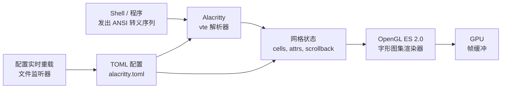

# Alacritty — 快速、跨平台的 OpenGL 终端模拟器

**Alacritty** 是一个为性能而生的终端模拟器。用 **Rust** 编写，
通过 **OpenGL ES 2.0** 加速渲染，采用 **Apache-2.0** 协议，
是当下最广泛部署的"最小、最快"终端之一。

与许多自带标签页、分屏和远程会话管理的终端不同，Alacritty
故意只做*一件事*：把文本渲染得快。分屏、多路复用和会话管理
是别人的活 —— 通常是 `tmux`、`zellij`，或一个平铺式窗口管理器。

> **TL;DR。** Alacritty 是经典的 GPU 终端。用
> `x env use alacritty` 安装，或 `brew install --cask alacritty`，
> 或 `apt install alacritty`。搭配 `tmux` 处理多路复用，就完事了。

## Alacritty 为什么存在？

传统终端用 CPU 渲染文本。这没问题 —— 直到你 `cat` 一个 500 MB
的日志文件、跑一个打印上千条 warning 的编译器、或流式推送构建日志。
CPU 渲染出现掉帧；scrollback 卡顿；输入感觉延迟。

Alacritty 的赌注很简单：终端模拟器本质上是一个把文本字形渲染成网格的
渲染器，这活儿属于 GPU。结果就是一个小型、专注的工具，把*模拟*部分
做得很棒，把*多路复用*部分交给 `tmux`（或你的 WM），然后让出舞台。

> Alacritty 是一个只做一件事的终端模拟器：把文本渲染得快。其他都是别人的活。

## 它长什么样？

<details><summary>界面 / 配置预览</summary>

```
┌─ ~/projects/alacritty — zsh ──────────────────────────── 78% ─┐
│ $ cargo build --release                                          │
│    Compiling alacritty_terminal v0.13.2                         │
│    Compiling alacritty v0.13.2                                  │
│     Finished `release` profile [optimized] in 4m 32s             │
│ ▾                                                             ▴ │
└─────────────────────────────────────────────────────────────────┘
  JetBrains Mono 11pt • 0.13.2 • OpenGL renderer
```

</details>

## 架构



两个 crate：`alacritty_terminal`（VTE 衍生的解析器 / 网格）
与 `alacritty`（OpenGL 窗口 + 事件循环）。渲染器使用 OpenGL ES 2.0
字形图集；配置由 `serde` 从 TOML 解析。`cargo build --release` 产出
单个二进制，零运行时依赖。

## 与相似工具的对比

| 工具 | 渲染器 | 多路复用 | 配置 | 最佳场景 |
| --- | --- | --- | --- | --- |
| **Alacritty** | OpenGL ES 2.0 | 外部（tmux） | TOML | 最小、最快、"只是个终端" |
| **[Kitty](https://sw.kovidgoyal.net/kitty/)** | OpenGL 3.3 | 内置（kitty-session） | 纯文本 | 图像协议、kittens、GPU 可扩展 |
| **[WezTerm](https://wezfurlong.org/wezterm/)** | wgpu | 内置（Lua） | Lua | 多路复用 + 脚本一体 |
| **[Ghostty](https://ghostty.org/)** | Metal / OpenGL | 外部（tmux） | TOML / MoonBit | 每平台原生 UI |
| **[Rio](https://github.com/raphamorim/rio)** | wgpu | 外部 | TOML | 较新的 Rust 替代 |
| **iTerm2** | CPU + Metal | 内置 | 偏好 UI | 仅 macOS，功能丰富 |
| **Windows Terminal** | DirectX | 内置（面板） | JSON | 仅 Windows，微软支持 |

## 何时用 vs 何时不用

**用 Alacritty 的场景：**

- 你想要 Linux / macOS / BSD / Windows 上最小、最快、GPU 加速的终端。
- 你愿意搭配 `tmux` / `zellij` / 平铺 WM 来分屏与会话。
- 重 `cat` / `tail -f` / `cargo build` / 日志流的重度用户会感受到差异。

**不用 Alacritty 的场景：**

- 你需要内置标签页与分屏（用 WezTerm 或 Kitty）。
- 你想要 GUI 配置编辑器（用 iTerm2 或 Windows Terminal）。
- 你的驱动 / 硬件的 OpenGL ES 2.0 支持有问题（罕见，但一些较老的虚拟化 GPU 上可能）。

## 如何安装

**x-cmd（一行命令）：**

```bash
x env use alacritty
```

**包管理器：**

```bash
# macOS（Homebrew）
brew install --cask alacritty

# Arch Linux
sudo pacman -S alacritty

# Debian / Ubuntu
sudo apt install alacritty

# Fedora
sudo dnf install alacritty

# Windows（Scoop）
scoop install alacritty

# Windows（Winget）
winget install Alacritty.Alacritty
```

**预构建二进制：** 从
[GitHub Releases](https://github.com/alacritty/alacritty/releases)
下载：macOS 用 `.dmg`，Windows 用 `.msi` / 便携版 `.exe`。

**从源码构建：**

```bash
cargo install alacritty
```

构建依赖（Debian/Ubuntu 示例）：

```bash
sudo apt install cmake pkg-config libfreetype6-dev libfontconfig1-dev \
                 libxcb-xfixes0-dev libxkbcommon-dev python3
```

## 配置

Alacritty 使用 **TOML**，默认不创建配置文件 —— 你自己造一个。

**Unix / Linux / macOS 搜索路径（按优先级）：**

1. `$XDG_CONFIG_HOME/alacritty/alacritty.toml`
2. `$XDG_CONFIG_HOME/alacritty.toml`
3. `$HOME/.config/alacritty/alacritty.toml`
4. `$HOME/.alacritty.toml`
5. `/etc/alacritty/alacritty.toml`

**Windows：** `%APPDATA%\alacritty\alacritty.toml`

### `alacritty.toml` 示例

```toml
[window]
padding = { x = 4, y = 4 }
opacity = 0.95
startup_mode = "Maximized"

[font]
normal = { family = "JetBrains Mono", style = "Regular" }
size = 11.0

[scrolling]
history = 10000

[selection]
save_to_clipboard = true

[cursor]
style = "Block"
blinking = "On"

[mouse]
double_click = { threshold = 300 }
triple_click = { threshold = 300 }
```

### 自定义键绑定

```toml
[[keyboard.bindings]]
key = "Space"
mods = "Control|Shift"
mode = "~Search"
action = "ToggleViMode"

[[keyboard.bindings]]
key = "N"
mods = "Control|Shift"
action = "CreateNewWindow"
```

**配置实时重载** —— Alacritty 监听配置文件；编辑后无需重启即可生效（可禁用）。

## 系统要求

| 要求 | 细节 |
| --- | --- |
| **OpenGL** | OpenGL ES 2.0 或更高 |
| **Windows** | ConPTY 支持（Windows 10 v1809 或更新） |
| **macOS** | 10.13+ |
| **构建** | 最新稳定 Rust 工具链（仅源码构建） |

## 关键功能

| 功能 | 描述 |
| --- | --- |
| **Vi 模式** | `Ctrl+Shift+Space` 进入；`v` 选择，`y` 复制。用 `h/j/k/l` 等在 scrollback 中导航。 |
| **搜索** | `Ctrl+Shift+f` 向前，`Ctrl+Shift+b` 向后，遍历 scrollback 缓冲。 |
| **Hints（提示）** | 用正则标记特定文本模式（URL、文件路径），供鼠标点击或键盘动作。 |
| **多窗口** | 通过 `alacritty msg create-window` 或键绑定实现单进程多窗口。 |
| **配置实时重载** | 编辑 `alacritty.toml` 后无需重启即可生效。 |
| **URL 检测** | 点击 URL（带修饰键）以在默认浏览器中打开。 |

**选区扩展** —— 选择后右键单击：单击按词扩展，双击到行，按住 `Ctrl`
进行块选择。

## 典型场景

- **重输出开发** —— `cargo build`、`cat huge.log`、`tail -f` 构建输出，
  所有让 CPU 渲染终端卡顿的活。
- **搭配 tmux** —— Alacritty 做渲染，`tmux` 做会话管理。经典的
  "快终端 + 多路复用器" 组合。
- **低资源服务器** —— 适合 X11 / Wayland / macOS / Windows 的轻量 GUI 终端，
  不吃内存。
- **键盘驱动工作流** —— Vi 模式、Hints、自定义绑定 —— Alacritty
  是为不想离开主键行的用户而生。

## 优 / 劣 / 结论

| 维度 | 结论 |
| --- | --- |
| **优** | 你能装上的最快终端之一；OpenGL 管线 + vtebench 测试胜出 |
| **优** | 单二进制，最小资源占用，在树莓派上也跑得欢 |
| **优** | Apache-2.0，无遥测，无账号，无 SaaS |
| **优** | TOML 配置实时重载；试配置无需重启 |
| **劣** | 无内置标签 / 分屏 / 多路复用器（用 tmux） |
| **劣** | 无 GUI 配置编辑器（用文本编辑器编辑 TOML） |
| **劣** | 需要 OpenGL ES 2.0 —— 一些虚拟化 GPU 有罕见的驱动问题 |
| **结论** | **推荐**给想要最大速度的终端重度用户；**跳过**如果你想要 iTerm2 那种一应俱全的终端。 |

## 需要记住的事

- **没有标签 / 分屏是特性，不是 bug。** 搭配 `tmux`、`zellij` 或
  你的平铺窗口管理器。单独用 Alacritty 做分屏只会带来挫败感。
- **配置实时重载默认开启。** 编辑 `alacritty.toml` 保存，立即看到效果。
  如果觉得分心，在 `[general]` 表里设 `live_config_reload = false` 关闭。
- **Windows 上要求 ConPTY。** Windows 10 1809+ 默认带 ConPTY；更老版本需要
  兜底或无法工作。
- **GPU 驱动很重要。** 如果看到渲染瑕疵，检查 OpenGL ES 2.0 驱动。
  绝大多数现代硬件直接可用。
- **图标密集的 prompt 用 Nerd Font。** JetBrains Mono Nerd Font、Fira Code
  Nerd Font、Hack Nerd Font 都行；在 `[font].normal.family` 配置。

## 时间线

- **2017-01** —— Joe Wilm 创建仓库，初始提交。
- **2017-12** —— Alacritty 0.1.0 —— 首次公开发布。
- **2018-08** —— 0.2.0 —— 主要稳定性 + 跨平台推进。
- **2019-10** —— 0.4.0 —— 性能重写；vtebench 成为项目基准。
- **2021-04** —— 0.9.0 —— 通过 ConPTY 稳定 Windows 支持。
- **2022-12** —— 0.12.0 —— TOML 配置取代 YAML；Alacritty 今日使用的格式。
- **2024-09** —— 0.13.0 —— 渲染器改进，scrollback 改进。
- **2026-03** —— 当前的 0.13.2 —— bug fix 系列；0.14 在开发。

## 源码巡礼

"正在跑"的核心位于
[`alacritty_terminal`](https://github.com/alacritty/alacritty/tree/master/alacritty_terminal)
crate（VTE 衍生的解析器 / 网格）和
[`alacritty`](https://github.com/alacritty/alacritty/tree/master/alacritty)
crate（OpenGL 窗口 + 事件循环）。渲染器使用 OpenGL ES 2.0 字形图集；
配置由 `serde` 从 TOML 解析。`cargo build --release` 产出二进制；
无运行时依赖。

## 下一步？

- **快速开始** —— `x env use alacritty`，然后把 `alacritty.toml` 放到
  `~/.config/alacritty/`。
- **搭配 tmux** —— `tmux` 做多路复用，Alacritty 做渲染 —— 经典搭配。
- **挑一个 Nerd Font** —— JetBrains Mono Nerd Font 是常见默认；
  在 `[font].normal.family` 里配置。

## 相关工具

- [Kitty](https://sw.kovidgoyal.net/kitty/) —— 图像协议友好的兄弟终端。
- [WezTerm](https://wezfurlong.org/wezterm/) —— 内置多路复用器；
  想要少折腾的替代选择。
- [tmux](https://github.com/tmux/tmux) —— 与 Alacritty 搭配的多路复用器。
- [btop](https://github.com/aristocratos/btop) —— 在 Alacritty *里*跑得
  很棒的终端资源监视器。
- [starship](https://starship.rs/) —— 在 Alacritty 里渲染完美的跨 shell prompt。
- [Nerd Fonts](https://www.nerdfonts.com/) —— 为图标密集 prompt 打补丁的字体。

## 源码与官方资源

- **GitHub：** <https://github.com/alacritty/alacritty>
- **官网：** <https://alacritty.org/>
- **配置参考：** <https://alacritty.org/config-alacritty.html>
- **功能文档：** <https://github.com/alacritty/alacritty/blob/master/docs/features.md>
- **vtebench：** <https://github.com/alacritty/vtebench>
- **发布：** <https://github.com/alacritty/alacritty/releases>
- **路线图 / issue：** <https://github.com/alacritty/alacritty/issues>