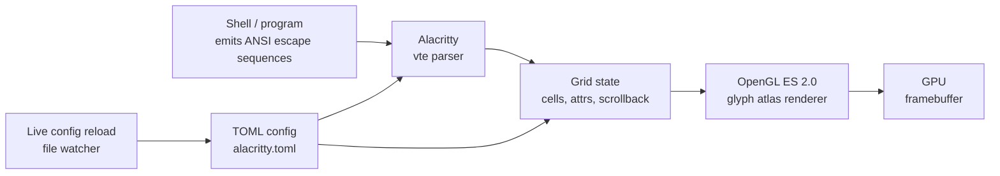

# Alacritty — A Fast, Cross-Platform OpenGL Terminal Emulator

**Alacritty** is a terminal emulator built for performance.
Written in **Rust**, GPU-accelerated via **OpenGL ES 2.0**,
distributed under **Apache-2.0**, it is one of the most widely
deployed "smallest, fastest" terminals available.

Unlike many terminals that ship tabs, splits, and a remote-
session manager, Alacritty deliberately does *one thing*:
render text, fast. Splitting, multiplexing, and session
management are someone else's job — usually `tmux`, `zellij`,
or a tiling window manager.

> **TL;DR.** Alacritty is the canonical GPU terminal. Install
> with `x env use alacritty`, or `brew install --cask alacritty`,
> or `apt install alacritty`. Pair it with `tmux` for
> multiplexing and you're done.

## Why does Alacritty exist?

Traditional terminals render text on the CPU. That works — until
you `cat` a 500 MB log file, run a compiler that prints thousands
of warnings, or stream a build log. CPU rendering hits frame
drops; scrollback stutters; the input feels laggy.

Alacritty's bet is simple: a terminal emulator is essentially
a renderer of text glyphs into a grid, and that work belongs
on the GPU. The result is a small, focused tool that does the
*emulation* part very well, hands the *multiplexing* part to
`tmux` (or your WM), and gets out of the way.

> Alacritty is a terminal emulator that does one thing:
> render text, fast. Everything else is someone else's job.

## What does it look like?

<details><summary>UI / config preview</summary>

```
┌─ ~/projects/alacritty — zsh ──────────────────────────── 78% ─┐
│ $ cargo build --release                                          │
│    Compiling alacritty_terminal v0.13.2                         │
│    Compiling alacritty v0.13.2                                  │
│     Finished `release` profile [optimized] in 4m 32s             │
│ ▾                                                             ▴ │
└─────────────────────────────────────────────────────────────────┘
  JetBrains Mono 11pt • 0.13.2 • OpenGL renderer
```

</details>

## Architecture



Two crates: `alacritty_terminal` (VTE-derived parser / grid)
and `alacritty` (the OpenGL window + event loop). The renderer
uses an OpenGL ES 2.0 glyph atlas; configuration is parsed by
`serde` from TOML. `cargo build --release` produces a single
binary with no runtime dependencies.

## How does it differ from similar tools?

| Tool | Renderer | Multiplexer | Config | Best for |
| --- | --- | --- | --- | --- |
| **Alacritty** | OpenGL ES 2.0 | External (tmux) | TOML | Smallest, fastest, "just terminal" |
| **[Kitty](https://sw.kovidgoyal.net/kitty/)** | OpenGL 3.3 | Built-in (kitty-session) | Plain text | Image protocols, kittens, GPU-extensible |
| **[WezTerm](https://wezfurlong.org/wezterm/)** | wgpu | Built-in (Lua) | Lua | Multiplexer + scripting in one |
| **[Ghostty](https://ghostty.org/)** | Metal / OpenGL | External (tmux) | TOML / MoonBit | Native per-platform UI |
| **[Rio](https://github.com/raphamorim/rio)** | wgpu | External | TOML | Newer Rust alternative |
| **iTerm2** | CPU + Metal | Built-in | Prefs UI | macOS-only, full-featured |
| **Windows Terminal** | DirectX | Built-in (panes) | JSON | Windows-only, Microsoft-supported |

## When to use vs when NOT

**Use Alacritty when:**

- You want the smallest, fastest, GPU-accelerated terminal on
  Linux / macOS / BSD / Windows.
- You're happy to pair it with `tmux` / `zellij` / a tiling WM
  for splits and sessions.
- Power users running heavy `cat` / `tail -f` / `cargo build`
  / log streaming will feel the difference.

**Don't use Alacritty when:**

- You need built-in tabs and splits (use WezTerm or Kitty).
- You want a GUI config editor (use iTerm2 or Windows Terminal).
- Your driver / hardware has flaky OpenGL ES 2.0 support
  (rare, but possible on some older virtualized GPUs).

## How to install

**x-cmd (one command):**

```bash
x env use alacritty
```

**Package managers:**

```bash
# macOS (Homebrew)
brew install --cask alacritty

# Arch Linux
sudo pacman -S alacritty

# Debian / Ubuntu
sudo apt install alacritty

# Fedora
sudo dnf install alacritty

# Windows (Scoop)
scoop install alacritty

# Windows (Winget)
winget install Alacritty.Alacritty
```

**Pre-built binaries:** Download from
[GitHub Releases](https://github.com/alacritty/alacritty/releases):
`.dmg` for macOS, `.msi` / portable `.exe` for Windows.

**Build from source:**

```bash
cargo install alacritty
```

Build dependencies (Debian/Ubuntu example):

```bash
sudo apt install cmake pkg-config libfreetype6-dev libfontconfig1-dev \
                 libxcb-xfixes0-dev libxkbcommon-dev python3
```

## Configuration

Alacritty uses **TOML** and does not create a config file by
default — you make one.

**Unix / Linux / macOS search paths (priority order):**

1. `$XDG_CONFIG_HOME/alacritty/alacritty.toml`
2. `$XDG_CONFIG_HOME/alacritty.toml`
3. `$HOME/.config/alacritty/alacritty.toml`
4. `$HOME/.alacritty.toml`
5. `/etc/alacritty/alacritty.toml`

**Windows:** `%APPDATA%\alacritty\alacritty.toml`

### Sample `alacritty.toml`

```toml
[window]
padding = { x = 4, y = 4 }
opacity = 0.95
startup_mode = "Maximized"

[font]
normal = { family = "JetBrains Mono", style = "Regular" }
size = 11.0

[scrolling]
history = 10000

[selection]
save_to_clipboard = true

[cursor]
style = "Block"
blinking = "On"

[mouse]
double_click = { threshold = 300 }
triple_click = { threshold = 300 }
```

### Custom key bindings

```toml
[[keyboard.bindings]]
key = "Space"
mods = "Control|Shift"
mode = "~Search"
action = "ToggleViMode"

[[keyboard.bindings]]
key = "N"
mods = "Control|Shift"
action = "CreateNewWindow"
```

**Live config reload** — Alacritty watches its config file;
edits apply without restart (can be disabled).

## System requirements

| Requirement | Detail |
| --- | --- |
| **OpenGL** | OpenGL ES 2.0 or higher |
| **Windows** | ConPTY support (Windows 10 v1809 or later) |
| **macOS** | 10.13+ |
| **Build** | Latest stable Rust toolchain (source build only) |

## Key features

| Feature | Description |
| --- | --- |
| **Vi Mode** | `Ctrl+Shift+Space` to enter; `v` to select, `y` to yank. Navigate scrollback with `h/j/k/l` and friends. |
| **Search** | `Ctrl+Shift+f` forward, `Ctrl+Shift+b` backward through the scrollback buffer. |
| **Hints** | Regex-marks specific text patterns (URLs, file paths) for mouse-click or keyboard action. |
| **Multi-Window** | Single-process multi-window via `alacritty msg create-window` or keybinding. |
| **Live Config Reload** | Edits to `alacritty.toml` apply without restart. |
| **URL Detection** | Click URLs (with modifier key) to open in the default browser. |

**Selection expansion** — right-click after a selection: single
click expands semantically (word), double click to line, hold
`Ctrl` for block selection.

## Typical use cases

- **Heavy-output dev** — `cargo build`, `cat huge.log`,
  `tail -f` of build output, all the things that make
  CPU-rendered terminals stutter.
- **tmux pairing** — Alacritty as the renderer, `tmux` as
  the session manager. The canonical "fast terminal +
  multiplexer" stack.
- **Low-resource servers** — A lightweight GUI terminal for
  X11 / Wayland / macOS / Windows that won't eat memory.
- **Keyboard-driven workflows** — Vi mode, Hints, custom
  bindings — Alacritty is built for users who don't want to
  leave the home row.

## Pro / Con / Verdict

| Dimension | Verdict |
| --- | --- |
| **Pro** | One of the fastest terminals you can install; OpenGL pipeline + vtebench wins |
| **Pro** | Single binary, minimal resource footprint, lives happily on a Raspberry Pi |
| **Pro** | Apache-2.0, no telemetry, no account, no SaaS |
| **Pro** | Live TOML config reload; no restart to try changes |
| **Con** | No built-in tabs / splits / multiplexer (use tmux) |
| **Con** | No GUI config editor (TOML in your text editor) |
| **Con** | Requires OpenGL ES 2.0 — rare driver issues on some virtualized GPUs |
| **Verdict** | **Recommended** for terminal power users who want maximum speed; **skip** if you want a one-app-does-it-all terminal like iTerm2. |

## Things to keep in mind

- **No tabs / splits is a feature, not a bug.** Pair Alacritty
  with `tmux`, `zellij`, or your tiling window manager. Trying
  to use Alacritty alone for splits leads to frustration.
- **Live config reload is on by default.** Edit
  `alacritty.toml`, save, see changes immediately. Disable
  with `live_config_reload = false` in the `[general]` table
  if you find it distracting.
- **On Windows, ConPTY is required.** Windows 10 1809+ ships
  ConPTY by default; older builds need a fallback or won't
  work.
- **GPU drivers matter.** If you see rendering glitches, check
  your OpenGL ES 2.0 driver. The vast majority of modern
  hardware Just Works.
- **Use a Nerd Font for icon-heavy prompts.** JetBrains Mono
  Nerd Font, Fira Code Nerd Font, Hack Nerd Font all work;
  configure `[font].normal.family`.

## Timeline

- **2017-01** — Joe Wilm creates the repo, initial commit.
- **2017-12** — Alacritty 0.1.0 — first public release.
- **2018-08** — 0.2.0 — major stability + cross-platform push.
- **2019-10** — 0.4.0 — performance rewrite; vtebench becomes
  the project benchmark.
- **2021-04** — 0.9.0 — Windows support stabilizes via ConPTY.
- **2022-12** — 0.12.0 — TOML config replaces YAML; the
  format Alacritty uses today.
- **2024-09** — 0.13.0 — renderer refinements, scrollback
  improvements.
- **2026-03** — current 0.13.2 — bug-fix line; 0.14 in
  development.

## Source-code tour

The "what's running" core sits in the
[`alacritty_terminal`](https://github.com/alacritty/alacritty/tree/master/alacritty_terminal)
crate (the VTE-derived parser / grid) and the
[`alacritty`](https://github.com/alacritty/alacritty/tree/master/alacritty)
crate (the OpenGL window + event loop). The renderer uses an
OpenGL ES 2.0 glyph atlas; configuration is parsed by `serde`
from TOML. `cargo build --release` produces the binary; no
runtime dependencies.

## What next?

- **Quick start** — `x env use alacritty`, then drop an
  `alacritty.toml` into `~/.config/alacritty/`.
- **Pair with tmux** — `tmux` for multiplexing, Alacritty for
  rendering — the canonical pairing.
- **Pick a Nerd Font** — JetBrains Mono Nerd Font is a common
  default; configure `[font].normal.family`.

## Related Tools

- [Kitty](https://sw.kovidgoyal.net/kitty/) — image-protocol-
  friendly sibling terminal.
- [WezTerm](https://wezfurlong.org/wezterm/) — bundled
  multiplexer; alternative if you want less wiring.
- [tmux](https://github.com/tmux/tmux) — the multiplexer to
  pair with Alacritty.
- [btop](https://github.com/aristocratos/btop) — terminal
  resource monitor that runs great *inside* Alacritty.
- [starship](https://starship.rs/) — cross-shell prompt that
  renders perfectly in Alacritty.
- [Nerd Fonts](https://www.nerdfonts.com/) — patched fonts for
  icon-heavy prompts.

## Source & Official Resources

- **GitHub:** <https://github.com/alacritty/alacritty>
- **Website:** <https://alacritty.org/>
- **Configuration reference:**
  <https://alacritty.org/config-alacritty.html>
- **Features documentation:**
  <https://github.com/alacritty/alacritty/blob/master/docs/features.md>
- **vtebench:** <https://github.com/alacritty/vtebench>
- **Releases:**
  <https://github.com/alacritty/alacritty/releases>
- **Roadmap / issues:**
  <https://github.com/alacritty/alacritty/issues>