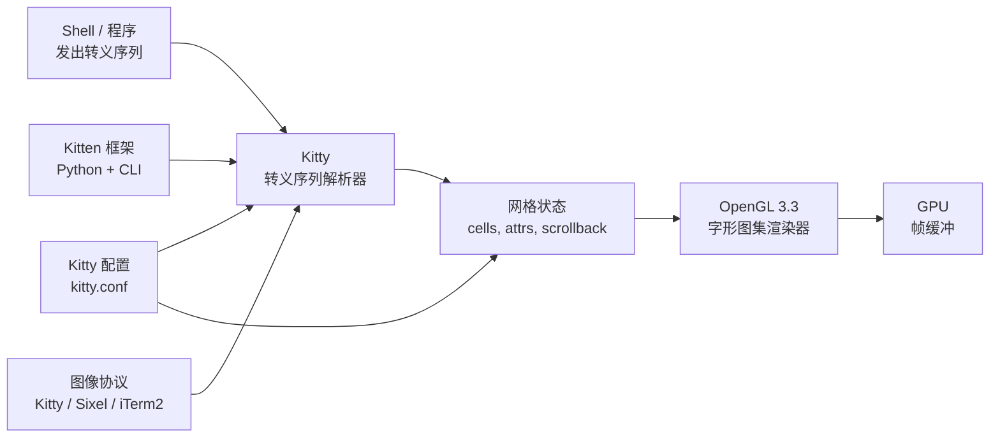

# Kitty — 支持图像协议与 kittens 的 GPU 加速终端

**Kitty** 是由 Kovid Goyal（Calibre 的作者）编写的 GPU 加速终端模拟器。
主要以 **C** 实现，部分用 **Python**，采用 **GPL-3.0** 协议。Kitty 是
对**图像协议**有**一流支持**、带可扩展 **kitten** 插件系统、以及内置
多路复用器的终端。

Kitty 的赌注：不是做最小、最快的终端（Alacritty 的赛道），而是做
**最可编程**的 GPU 终端。它自带自定义图形协议、可扩展的
command / kitten 框架，以及与文本编辑器工作流的紧密集成（`kitten
icat`、`kitten diff` 等）。

> **TL;DR。** Kitty 是经典的"带图像协议的 GPU 终端"。用
> `x env use kitty` 安装，或 `brew install --cask kitty`，或
> `apt install kitty`。一流图像协议（Sixel、Kitty graphics、
> iTerm2）、可扩展 kitten 系统、内置多路复用器，全部自带。

## Kitty 为什么存在？

Alacritty 证明了 GPU 终端可行。Kitty 在 GPU 终端基础上加上其他没
有的**可编程原语**：

1. **图像协议。** Kitty 图形协议、Sixel、iTerm2——全部支持。在终端
   内直接渲染图像、动画、内联图形。
2. **Kittens。** 小命令框架。每个 kitten 是 shell 脚本或 Python 程序，
   跑在 Kitty 内部接口上。`kitten icat` 显示图像；`kitten diff`
   并排显示文件差异；`kitten hyperlinked-grep` 让 grep 匹配可点击。
3. **内置多路复用器。** Kitty 会话——通过 `kitty @ launch` 与
   `Ctrl+Shift+Enter` 焦点切换分屏。更重的复用搭配 tmux。
4. **GPU 可扩展性。** 图形协议允许任意程序渲染到终端——kitty 自身、
   `neofetch`、`viu`、`chafa` 等都在用。

## 架构



两个组件：

- `kitty` —— 基于 C 的终端二进制。
- `kittens` —— 小伙伴程序（Python）。每个 kitten 跑在独立进程里，
  通过 Unix 套接字与 kitty 通信。

## 与相似工具的对比

| 工具 | 渲染器 | 多路复用 | 图像协议 | 最佳场景 |
| --- | --- | --- | --- | --- |
| **Kitty** | OpenGL 3.3 | 内置（kitty-session） | ✅ Sixel、Kitty、iTerm2 | 图像协议、kittens、GPU 可扩展 |
| **[Alacritty](https://alacritty.org/)** | OpenGL ES 2.0 | 外部（tmux） | ⚠️ 有限（0.13 起 Sixel） | 最小、最快、"只是个终端" |
| **[WezTerm](https://wezfurlong.org/wezterm/)** | wgpu | 内置（Lua） | ✅ iTerm2、Sixel | 多路复用 + 脚本一体 |
| **[Ghostty](https://ghostty.org/)** | Metal / OpenGL | 外部（tmux） | ✅ Sixel（1.0 起） | 每平台原生 UI |
| **[Rio](https://github.com/raphamorim/rio)** | wgpu | 外部 | ⚠️ 有限 | 较新的 Rust 替代 |

## 何时用 vs 何时不用

**用 Kitty 的场景：**

- 你想内联显示图像（`kitten icat`、`viu`）。
- 你想用 kittens 扩展终端。
- 你想要内置多路复用器而不依赖 tmux。
- 你想要最可配置的 GPU 终端之一。

**不用 Kitty 的场景：**

- 你想要最小、最快的终端（用 Alacritty）。
- 你想要原生 macOS UI（用 Ghostty 的原生 AppKit）。
- 你想要极简配置（用 Rio）。
- 你想要最受欢迎的 GPU 终端生态（用 WezTerm 或 Ghostty）。

## 如何安装

**x-cmd（一行命令）：**

```bash
x env use kitty
```

**包管理器：**

```bash
# macOS（Homebrew）
brew install --cask kitty

# Arch Linux
sudo pacman -S kitty

# Debian / Ubuntu（自 20.04 起）
sudo apt install kitty

# Fedora
sudo dnf install kitty

# openSUSE
sudo zypper install kitty

# Void Linux
sudo xbps-install kitty
```

**预构建二进制：** 从
[GitHub Releases](https://github.com/kovidgoyal/kitty/releases)
下载。

**从源码构建：** `git clone https://github.com/kovidgoyal/kitty`
+ `python3 setup.py build`（完整 Python 构建，耗时）。

## 配置

Kitty 使用**纯文本**配置格式（`kitty.conf`）。注释 `#`，section 用
`[name]`。

**配置文件位置：**

- Linux：`~/.config/kitty/kitty.conf`
- macOS：`~/.config/kitty/kitty.conf`
- 任意位置：`KITTY_CONFIG_DIRECTORY=/path/to/dir`

### `kitty.conf` 示例

```conf
# 字体
font_family      JetBrains Mono
font_size        12.0
bold_font        auto
italic_font      auto

# 窗口
window_padding_width 4
background_opacity    0.95

# 光标
cursor_shape      Beam
cursor_blink_interval 0.5

# Scrollback
scrollback_lines 10000

# 鼠标
mouse_hide_wait  2.0

# 选区
select_by_word   forward

# 标签栏
tab_bar_edge     bottom
tab_bar_style    powerline

# 键盘
map ctrl+shift+enter launch --stdin-source=@scrollback --stdin-add-formatting --type=window
map ctrl+shift+s    kitten hyperlinked-grep
```

### 配置实时重载

Kitty 保存 `kitty.conf` 时自动重载。也可以用 `Ctrl+Shift+,`
（默认 `reload_config` 键绑定）强制重载。

## 图像协议

Kitty 自带三种图像协议的一流支持：

| 协议 | 来源 | Kitty 中状态 |
| --- | --- | --- |
| **Kitty graphics** | Kitty 原生 | ✅ 一流——由 Kitty 设计 |
| **Sixel** | DEC VT340（1980 年代） | ✅ 自 0.26 起稳定 |
| **iTerm2** | iTerm2（2009） | ✅ 稳定 |

显示图像：

```sh
# 显示单张图像
kitten icat image.png

# 显示动画 GIF
kitten icat animation.gif

# 在 shell 输出中内联图像（例如带图像预览的 ls）
ls --classify | kitten icat --align left
```

## Kittens —— 扩展系统

**kitten** 是与 Kitty 内部接口通过 Unix 套接字通信的小伙伴程序。
每个 kitten 与 kitty 一起发布，存放在 `kittens/` 源码目录。

| Kitten | 用途 |
| --- | --- |
| `icat` | 内联显示图像。 |
| `diff` | 并排文件差异。 |
| `hyperlinked-grep` | 让 grep 匹配可点击。 |
| `unicode_input` | Unicode 字符选择器。 |
| `themes` | 在配色方案间切换。 |
| `transfer` | 通过 kitty 终端上传 / 下载文件。 |
| `ssh` | 打开一个通过本地 kitty 渲染的远程 ssh 会话。 |
| `clipboard` | 从终端操作系统剪贴板。 |

通过在 Python 中子类化 `kittens.tui.URILoop` 等来编写自己的 kitten。

## 系统要求

| 要求 | 细节 |
| --- | --- |
| **OpenGL** | OpenGL 3.3 或更高 |
| **平台** | Linux、macOS、BSD |
| **Windows** | 不官方支持（用 Alacritty / WezTerm / Ghostty） |
| **构建** | C 编译器 + Python 3.7+（源码构建） |

## 关键功能

| 功能 | 描述 |
| --- | --- |
| **图像协议** | Sixel、Kitty graphics、iTerm2。显示图像、动画、内联图形。 |
| **Kittens** | icat、diff、ssh、themes、transfer 等小伙伴程序。 |
| **内置多路复用器** | 通过 `Ctrl+Shift+Enter` 和 `kitty @ launch` 分屏。 |
| **标签栏** | 底部 / 顶部标签栏，支持 Powerline / fade / slant 样式。 |
| **配置实时重载** | `kitty.conf` 编辑后保存即生效。 |
| **GPU 可扩展性** | 任意程序可通过 Kitty graphics 协议渲染到终端。 |
| **URL 检测** | 点击 URL 以在默认浏览器中打开。 |
| **搜索** | 通过 scrollback 做正则搜索。 |
| **键盘协议** | Kitty 的键盘协议——应用可更精确地区分按键。 |
| **Shell 集成** | 在 scrollback 中标记每个命令的开始 / 结束，便于回顾。 |

## 典型场景

- **图像丰富的工作流** —— 在终端中预览图像、动画、内联图形。
- **开发者工具** —— `kitten diff` 并排文件差异；`kitten hyperlinked-grep` 可点击的 grep 匹配。
- **远程会话** —— `kitten ssh user@host` 通过本地 Kitty 渲染远程会话；跨 SSH 边界支持 GPU 协议。
- **重度配置** —— Kitty 的 `kitty.conf` 高度可配置；每个细节都有开关。
- **多窗口 + 多面板** —— `kitty @ launch` + 标签栏。

## 优 / 劣 / 结论

| 维度 | 结论 |
| --- | --- |
| **优** | 一流图像协议（3 种） |
| **优** | 可扩展 kitten 系统 |
| **优** | 内置多路复用器 |
| **优** | GPU 可扩展性——程序可渲染到终端 |
| **优** | 高度可配置（kitty.conf） |
| **优** | 配置实时重载 |
| **劣** | Windows 不官方支持 |
| **劣** | 比 Alacritty 大（功能多、二进制大） |
| **劣** | 源码构建依赖较老的 Python |
| **结论** | **推荐**给图像丰富工作流和插件可扩展设置；**跳过**如果你想要最小终端或原生 Windows 支持。 |

## 需要记住的事

- **Windows 不官方支持。** 在 Windows 上用 Alacritty、WezTerm 或 Ghostty。
- **要求 OpenGL 3.3。** 一些较老的虚拟化 GPU 可能需要更新驱动。
- **Kittens 跑在独立进程中。** 它们通过 Unix 套接字与 kitty 通信；
  如果套接字不可用（SSH 不加 `-R`），kittens 不工作。
- **应用偏好的图像协议不同。** 有些偏好 iTerm2，有些偏好 Sixel，
  有些偏好 Kitty graphics。把 Kitty 配置成三种都启用。
- **GPL-3.0。** 比 Apache-2.0 / MIT 严格。如果你 fork 并分发，源码
  必须开源。

## 时间线

- **2016-08** —— Kitty 0.1.0 —— 首次发布。
- **2017** —— OpenGL 渲染器取代早期 Cairo 后端。
- **2018** —— Kitty 图形协议设计发布。
- **2019-09** —— 加入 Sixel 支持（0.13）。
- **2020** —— 通过 `kitty @ launch` 实现内置多路复用。
- **2022** —— Kitty 0.26 —— iTerm2 图像协议支持。
- **2024-09** —— Kitty 0.40 —— 要求 OpenGL 3.3（旧为 3.0）。
- **2026-05** —— 当前的 0.43 —— 新图形光标；协议改进。

## 源码巡礼

Kitty 在 [`kovidgoyal/kitty`](https://github.com/kovidgoyal/kitty)。
主要组件：

- `kitty/` —— 基于 C 的终端二进制。
- `kittens/` —— 基于 Python 的 kitten 框架。
- `docs/` —— 详尽的配置 + 协议文档。

构建：

```bash
git clone https://github.com/kovidgoyal/kitty
cd kitty
python3 setup.py build
./linux_x86_64/kitty/launcher/kitty
```

## 下一步？

- **快速开始** —— `x env use kitty`，然后把 `kitty.conf` 放进
  `~/.config/kitty/`。
- **显示图像** —— `kitten icat image.png`。
- **并排差异** —— `kitten diff file1 file2`。
- **可点击 grep** —— 把 grep 管道到 `kitten hyperlinked-grep`。

## 相关工具

- [Alacritty](https://alacritty.org/) —— 最小、最快的 GPU 终端。
- [WezTerm](https://wezfurlong.org/wezterm/) —— 内置多路复用 + Lua 脚本。
- [Ghostty](https://ghostty.org/) —— 每平台原生 UI。
- [tmux](https://github.com/tmux/tmux) —— 更重的多路复用。
- [viu](https://github.com/atanunq/viu) —— 使用 iTerm2 / Kitty graphics 协议的终端图像查看器。

## 源码与官方资源

- **官网：** <https://sw.kovidgoyal.net/kitty/>
- **GitHub：** <https://github.com/kovidgoyal/kitty>
- **配置参考：** <https://sw.kovidgoyal.net/kitty/conf.html>
- **协议文档：** <https://sw.kovidgoyal.net/kitty/protocol.html>
- **发布：** <https://github.com/kovidgoyal/kitty/releases>
- **路线图 / issue：** <https://github.com/kovidgoyal/kitty/issues>