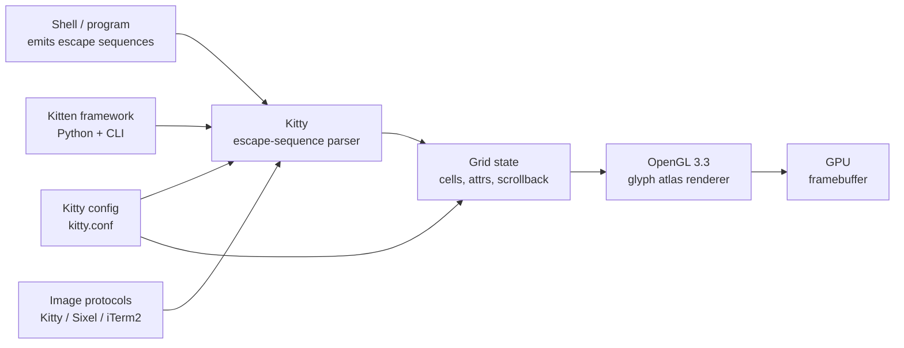

# Kitty — A GPU-Accelerated Terminal with Image Protocols and Kittens

**Kitty** is a GPU-accelerated terminal emulator written by
Kovid Goyal, the creator of Calibre. Implemented primarily
in **C** with some **Python**, distributed under **GPL-3.0**,
Kitty is the terminal that ships first-class support for
**image protocols**, an extensible **kitten** plugin system,
and a built-in multiplexer.

Kitty's bet: rather than being the smallest, fastest terminal
(Alacritty's niche), Kitty is the **most programmable** GPU
terminal. It ships a custom protocol for graphics, an
extensible command / kitten framework, and tight integration
with text-editor workflows (`kitten icat`, `kitten diff`, …).

> **TL;DR.** Kitty is the canonical "GPU terminal with image
> protocols". Install with `x env use kitty`, or `brew install
> --cask kitty`, or `apt install kitty`. First-class image
> protocols (Sixel, Kitty graphics, iTerm2), an extensible
> kitten system, and a built-in multiplexer all ship in.

## Why does Kitty exist?

Alacritty proved GPU terminals were viable. Kitty takes the
GPU-terminal idea and adds **programmable primitives** the
others don't have:

1. **Image protocols.** Kitty graphics protocol, Sixel,
   iTerm2 — all supported. Render images, animations, and
   inline graphics directly in the terminal.
2. **Kittens.** A small-command framework. Each kitten is a
   shell script or Python program that runs against Kitty's
   internals. `kitten icat` displays images; `kitten diff`
   shows file diffs side-by-side; `kitten hyperlinked-grep`
   makes grep matches clickable.
3. **Built-in multiplexer.** Kitty sessions — split panes
   with `kitty @ launch` and `Ctrl+Shift+Enter` to focus.
   For heavier multiplexing, pair with tmux.
4. **GPU extensibility.** The graphics protocol lets any
   program render to the terminal — used by `kitty` itself,
   by `neofetch`, by `viu`, by `chafa`, and many more.

## Architecture



Two components:

- `kitty` — the C-based terminal binary.
- `kittens` — the small companion programs (Python). Each
  kitten runs as a separate process and talks to kitty over a
  Unix socket.

## How does it differ from similar tools?

| Tool | Renderer | Multiplexer | Image protocols | Best for |
| --- | --- | --- | --- | --- |
| **Kitty** | OpenGL 3.3 | Built-in (kitty-session) | ✅ Sixel, Kitty, iTerm2 | Image protocols, kittens, GPU-extensible |
| **[Alacritty](https://alacritty.org/)** | OpenGL ES 2.0 | External (tmux) | ⚠️ Limited (Sixel since 0.13) | Smallest, fastest, "just terminal" |
| **[WezTerm](https://wezfurlong.org/wezterm/)** | wgpu | Built-in (Lua) | ✅ iTerm2, Sixel | Multiplexer + scripting in one |
| **[Ghostty](https://ghostty.org/)** | Metal / OpenGL | External (tmux) | ✅ Sixel (since 1.0) | Native per-platform UI |
| **[Rio](https://github.com/raphamorim/rio)** | wgpu | External | ⚠️ Limited | Newer Rust alternative |

## When to use vs when NOT

**Use Kitty when:**

- You want to display images inline (`kitten icat`, `viu`).
- You want to extend the terminal with kittens.
- You want a built-in multiplexer without depending on tmux.
- You want one of the most configurable GPU terminals.

**Don't use Kitty when:**

- You want the smallest, fastest terminal (use Alacritty).
- You want native macOS UI (use Ghostty for native AppKit).
- You want minimal config (use Rio).
- You want the most popular GPU terminal ecosystem (use
  WezTerm or Ghostty).

## How to install

**x-cmd (one command):**

```bash
x env use kitty
```

**Package managers:**

```bash
# macOS (Homebrew)
brew install --cask kitty

# Arch Linux
sudo pacman -S kitty

# Debian / Ubuntu (since 20.04)
sudo apt install kitty

# Fedora
sudo dnf install kitty

# openSUSE
sudo zypper install kitty

# Void Linux
sudo xbps-install kitty
```

**Pre-built binaries:** Download from
[GitHub Releases](https://github.com/kovidgoyal/kitty/releases).

**Build from source:** `git clone https://github.com/kovidgoyal/kitty`
+ `python3 setup.py build` (full Python build; takes time).

## Configuration

Kitty uses a **plain-text** config format (`kitty.conf`).
Comments are `#`, sections are `[name]`.

**Config location:**

- Linux: `~/.config/kitty/kitty.conf`
- macOS: `~/.config/kitty/kitty.conf`
- Anywhere: `KITTY_CONFIG_DIRECTORY=/path/to/dir`

### Sample `kitty.conf`

```conf
# Font
font_family      JetBrains Mono
font_size        12.0
bold_font        auto
italic_font      auto

# Window
window_padding_width 4
background_opacity    0.95

# Cursor
cursor_shape      Beam
cursor_blink_interval 0.5

# Scrollback
scrollback_lines 10000

# Mouse
mouse_hide_wait  2.0

# Selection
select_by_word   forward

# Tab bar
tab_bar_edge     bottom
tab_bar_style    powerline

# Keyboard
map ctrl+shift+enter launch --stdin-source=@scrollback --stdin-add-formatting --type=window
map ctrl+shift+s    kitten hyperlinked-grep
```

### Live config reload

Kitty reloads `kitty.conf` automatically on save. You can
also force-reload with `Ctrl+Shift+,` (the `reload_config`
default keybinding).

## Image protocols

Kitty ships first-class support for three image protocols:

| Protocol | Origin | Status in Kitty |
| --- | --- | --- |
| **Kitty graphics** | Kitty-native | ✅ First-class — designed by Kitty |
| **Sixel** | DEC VT340 (1980s) | ✅ Stable since 0.26 |
| **iTerm2** | iTerm2 (2009) | ✅ Stable |

To display an image:

```sh
# Display a single image
kitten icat image.png

# Display an animated GIF
kitten icat animation.gif

# Inline image in shell output (e.g. ls with image preview)
ls --classify | kitten icat --align left
```

## Kittens — the extension system

A **kitten** is a small companion program that talks to
Kitty's internals over a Unix socket. Each kitten is shipped
with kitty and lives in the `kittens/` source directory.

| Kitten | Purpose |
| --- | --- |
| `icat` | Display images inline. |
| `diff` | Side-by-side file diff. |
| `hyperlinked-grep` | Make grep matches clickable. |
| `unicode_input` | Unicode character picker. |
| `themes` | Switch between color themes. |
| `transfer` | Upload / download files via the kitty terminal. |
| `ssh` | Open a remote ssh session that renders through local kitty. |
| `clipboard` | Manipulate the system clipboard from the terminal. |

Write your own kitten by subclassing `kittens.tui.URILoop` or
similar in Python.

## System requirements

| Requirement | Detail |
| --- | --- |
| **OpenGL** | OpenGL 3.3 or higher |
| **Platforms** | Linux, macOS, BSD |
| **Windows** | Not officially supported (Alacritty / WezTerm are) |
| **Build** | C compiler + Python 3.7+ for source build |

## Key features

| Feature | Description |
| --- | --- |
| **Image protocols** | Sixel, Kitty graphics, iTerm2. Display images, animations, inline graphics. |
| **Kittens** | Small companion programs for icat, diff, ssh, themes, transfer, etc. |
| **Built-in multiplexer** | Split panes via `Ctrl+Shift+Enter` and `kitty @ launch`. |
| **Tab bar** | Bottom / top tab bar with Powerline / fade / slant styles. |
| **Live config reload** | Edits to `kitty.conf` apply on save. |
| **GPU extensibility** | Any program can render to the terminal via Kitty graphics protocol. |
| **URL detection** | Click URLs to open in the default browser. |
| **Search** | Regex search through scrollback. |
| **Keyboard protocol** | Kitty's keyboard protocol — apps can distinguish keys more precisely. |
| **Shell integration** | Marks each command's start / end in scrollback for easy review. |

## Typical use cases

- **Image-rich workflows** — preview images, animations, and
  inline graphics directly in the terminal.
- **Developer tools** — `kitten diff` for side-by-side file
  diffs; `kitten hyperlinked-grep` for clickable grep matches.
- **Remote sessions** — `kitten ssh user@host` renders the
  remote session through local Kitty; supports GPU protocols
  across the SSH boundary.
- **Heavy configuration** — Kitty's `kitty.conf` is highly
  configurable; everything has a knob.
- **Multi-window + multi-pane** — `kitty @ launch` + tab bar.

## Pro / Con / Verdict

| Dimension | Verdict |
| --- | --- |
| **Pro** | First-class image protocols (3 of them) |
| **Pro** | Extensible kitten system |
| **Pro** | Built-in multiplexer |
| **Pro** | GPU extensibility — programs can render to the terminal |
| **Pro** | Highly configurable (kitty.conf) |
| **Pro** | Live config reload |
| **Con** | Not officially supported on Windows |
| **Con** | Larger than Alacritty (more features, more binary) |
| **Con** | Older Python dependency for source build |
| **Verdict** | **Recommended** for image-rich workflows and plugin-extensible setups; **skip** if you want the smallest terminal or native Windows support. |

## Things to keep in mind

- **Windows is not officially supported.** Use Alacritty,
  WezTerm, or Ghostty on Windows.
- **OpenGL 3.3 required.** Some older virtualized GPUs may
  need driver updates.
- **Kittens run in a separate process.** They talk to kitty
  over a Unix socket; if the socket is unavailable (SSH
  without `-R`), kittens won't work.
- **Image protocols vary by application.** Some apps prefer
  iTerm2, others prefer Sixel, others prefer Kitty graphics.
  Configure Kitty to enable all three.
- **GPL-3.0.** Stricter than Apache-2.0 / MIT. If you fork
  and distribute, the source must be open.

## Timeline

- **2016-08** — Kitty 0.1.0 — first release.
- **2017** — OpenGL renderer replaces the early Cairo backend.
- **2018** — Kitty graphics protocol design published.
- **2019-09** — Sixel support added (0.13).
- **2020** — Built-in multiplexer via `kitty @ launch`.
- **2022** — Kitty 0.26 — iTerm2 image protocol support.
- **2024-09** — Kitty 0.40 — OpenGL 3.3 required (was 3.0).
- **2026-05** — current 0.43 — new graphics cursor; protocol
  refinements.

## Source-code tour

Kitty lives in
[`kovidgoyal/kitty`](https://github.com/kovidgoyal/kitty). Major
components:

- `kitty/` — the C-based terminal binary.
- `kittens/` — the Python-based kitten framework.
- `docs/` — extensive configuration + protocol documentation.

Build:

```bash
git clone https://github.com/kovidgoyal/kitty
cd kitty
python3 setup.py build
./linux_x86_64/kitty/launcher/kitty
```

## What next?

- **Quick start** — `x env use kitty`, then drop a
  `kitty.conf` into `~/.config/kitty/`.
- **Display an image** — `kitten icat image.png`.
- **Side-by-side diff** — `kitten diff file1 file2`.
- **Clickable grep** — pipe grep through `kitten hyperlinked-grep`.

## Related Tools

- [Alacritty](https://alacritty.org/) — the smallest, fastest
  GPU terminal.
- [WezTerm](https://wezfurlong.org/wezterm/) — bundled
  multiplexer + Lua scripting.
- [Ghostty](https://ghostty.org/) — native per-platform UI.
- [tmux](https://github.com/tmux/tmux) — for heavier
  multiplexing.
- [viu](https://github.com/atanunq/viu) — terminal image
  viewer that uses iTerm2 / Kitty graphics protocols.

## Source & Official Resources

- **Website:** <https://sw.kovidgoyal.net/kitty/>
- **GitHub:** <https://github.com/kovidgoyal/kitty>
- **Configuration reference:**
  <https://sw.kovidgoyal.net/kitty/conf.html>
- **Protocol documentation:**
  <https://sw.kovidgoyal.net/kitty/protocol.html>
- **Releases:**
  <https://github.com/kovidgoyal/kitty/releases>
- **Roadmap / issues:**
  <https://github.com/kovidgoyal/kitty/issues>