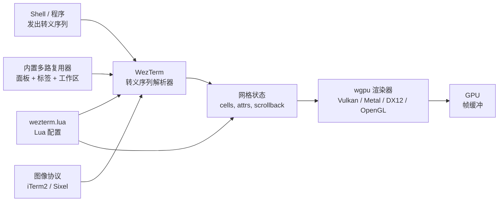

# WezTerm — 内置多路复用器与 Lua 脚本的 GPU 终端

**WezTerm** 是一款用 **Rust** 编写的 GPU 加速终端模拟器，自带
**内置多路复用器**、用于配置和运行时扩展的 **Lua 脚本**、以及
**iTerm2** 与 **Sixel** 图像协议支持。MIT 协议，WezTerm 支持
**Linux、macOS、Windows、BSD**。

WezTerm 的赌注：把多路复用 + 脚本放进终端本身，让大多数工作流
不需要 `tmux` 或 `zellij`。配置是完整的 Lua 程序——`wezterm.lua`——
可以动态修改键绑定、定义事件处理器、调用完整的 WezTerm API。

> **TL;DR。** WezTerm 是经典的"多路复用 + 脚本一体"终端。用
> `x env use wezterm` 安装，或 `brew install --cask wezterm`，
> 或 `apt install wezterm`。Lua 配置、内置面板与标签、
> iTerm2 / Sixel 图像协议，全部在一个 Rust 二进制里。

## WezTerm 为什么存在？

大多数终端拆分职责：终端渲染文本；`tmux` 做多路复用；`.zshrc`
配置 shell；另起工具处理图像。WezTerm 把它们整合：

1. **内置多路复用器。** 面板、标签、工作区模型——无需独立 tmux 进程。
2. **Lua 脚本。** 配置是 Lua 程序。`wezterm.lua` 可以定义事件处理器、
   监听文件、调用操作系统、对终端事件做出反应。
3. **图像协议。** iTerm2（完整）+ Sixel——内联显示图像与动画。
4. **通过 wgpu 的 GPU 渲染。** 跨平台 GPU 加速
   （Vulkan / Metal / DX12 / OpenGL）。

## 架构



几个 Rust crate（内部拆分）：

- `wezterm` —— 终端二进制。
- `wezterm-gui` —— GUI / 窗口 / 事件循环。
- `wezterm-mux` —— 内置多路复用器。
- `config` —— Lua 配置加载器。

## 与相似工具的对比

| 工具 | 渲染器 | 多路复用 | 配置 | 最佳场景 |
| --- | --- | --- | --- | --- |
| **WezTerm** | wgpu | 内置（Lua） | Lua | 多路复用 + 脚本一体 |
| **[Kitty](https://sw.kovidgoyal.net/kitty/)** | OpenGL 3.3 | 内置（kitty-session） | 纯文本 | 图像协议、kittens |
| **[Alacritty](https://alacritty.org/)** | OpenGL ES 2.0 | 外部（tmux） | TOML | 最小、最快 |
| **[Ghostty](https://ghostty.org/)** | Metal / OpenGL | 外部（tmux） | TOML / MoonBit | 每平台原生 UI |
| **[Tabby](https://tabby.sh/)** | CPU（Electron） | 内置 | YAML | GUI 配置、SSH 管理 |

## 何时用 vs 何时不用

**用 WezTerm 的场景：**

- 你想要内置多路复用器而不依赖 tmux。
- 你想要 Lua 脚本以做运行时配置。
- 你想要跨平台一致（Linux / macOS / Windows / BSD 一个二进制）。
- 你想要 iTerm2 / Sixel 图像协议。

**不用 WezTerm 的场景：**

- 你想要最小终端（用 Alacritty）。
- 你想要原生 macOS UI（用 Ghostty 的原生 AppKit）。
- 你想要 kitten 风格插件系统（用 Kitty）。
- 你想要零学习曲线（用 iTerm2 / Windows Terminal）。

## 如何安装

**x-cmd（一行命令）：**

```bash
x env use wezterm
```

**包管理器：**

```bash
# macOS（Homebrew）
brew install --cask wezterm

# Arch Linux
sudo pacman -S wezterm

# Debian / Ubuntu
#（snap 或 .deb 来自 GitHub Releases — 见下）
sudo snap install wezterm

# Fedora
sudo dnf install wezterm

# Windows（Scoop）
scoop install wezterm

# Windows（Winget）
winget install wezterm.wezterm
```

**预构建二进制：** 从
[GitHub Releases](https://github.com/wez/wezterm/releases)
下载：Linux（.deb / .AppImage / tarball）、Windows（.exe 安装包 /
便携版 .zip）。

**从源码构建：** `cargo install wezterm`（需要 Rust 工具链；完整
构建耗时）。

## 配置

WezTerm 使用 **Lua** 配置（`wezterm.lua`）。它是完整的 Lua 程序
——可以定义函数、监听文件、发出事件。

**配置文件位置：**

- Linux：`~/.config/wezterm/wezterm.lua`
- macOS：`~/.config/wezterm/wezterm.lua`
- Windows：`%APPDATA%\wezterm\wezterm.lua`

### `wezterm.lua` 示例

```lua
-- 引入几个有用的 WezTerm API
local wezterm = require 'wezterm'
local act = wezterm.action

-- Config
return {
  font_size = 11.0,
  font = wezterm.font 'JetBrains Mono',
  color_scheme = 'Catppuccin Mocha',

  -- 窗口内边距
  window_padding = { left = 4, right = 4, top = 4, bottom = 4 },

  -- 背景透明度
  window_background_opacity = 0.95,

  -- 键绑定
  keys = {
    { key = 'a', mods = 'CTRL|SHIFT', action = act.SelectText { 'Visual' } },
    { key = 'Enter', mods = 'CTRL|SHIFT', action = act.SpawnCommandInNewWindow {
      args = { 'zsh' },
    } },
  },

  -- 内置多路复用器
  mux_enable_default_keybindings = true,

  -- 标签栏
  tab_bar_at_bottom = true,

  -- 配置实时重载（文件监听）
  automatically_reload_config = true,
}
```

### 配置实时重载

设 `automatically_reload_config = true`（默认 true），WezTerm
监听 `wezterm.lua`。编辑保存后无需重启即可生效。

## 内置多路复用器

WezTerm 的多路复用器使用 **mux-server** 模型。用
`wezterm-mux-server` 启动 mux 服务器，然后用 `wezterm connect`
连接客户端。或者直接用 GUI 内置的。

默认键绑定（`mux_enable_default_keybindings = true` 时）：

| 动作 | 默认绑定 |
| --- | --- |
| 水平分屏 | `Ctrl+Alt+|` |
| 垂直分屏 | `Ctrl+Alt+_` |
| 激活面板（焦点） | `Ctrl+Alt+h/j/k/l` |
| 新标签 | `Ctrl+Alt+t` |
| 关闭面板 | `Ctrl+Alt+w` |
| 脱离 / 重连 | `:mux:detach` / `wezterm connect` |

更重的多路复用（跨机器会话持久化）可搭配 `tmux` 或 `zellij`。

## 图像协议

WezTerm 自带两种图像协议支持：

| 协议 | WezTerm 中状态 |
| --- | --- |
| **iTerm2** | ✅ 完整——包括动画 |
| **Sixel** | ✅ 稳定 |
| Kitty graphics | ❌ 未实现 |

显示图像：

```sh
# 显示单张图像
wezterm imgcat image.png

# 在 TUI 中显示（例如 yazi 文件管理器）
yazi   # 通过 wezterm 支持 iTerm2 与 Sixel
```

## Lua 脚本——超越配置

`wezterm.lua` 可以订阅事件：

```lua
-- 监听文件并响应
wezterm.on('window-focus-changed', function(window, pane)
  if window:get_title() == 'work' then
    window:set_title('work — focused')
  end
end)

-- 覆盖默认 URL 处理器
wezterm.on('open-uri', function(window, pane, uri)
  -- 打开前的自定义逻辑
  wezterm.log_info('opening ' .. uri)
  -- 用自定义命令打开
  wezterm.run_child_process { 'firefox', uri }
end)

-- 自定义 domain
wezterm.on('format-window-title', function(title, pane)
  return pane:get_current_working_dir().file_name .. ' — ' .. title
end)
```

Lua API 表面文档在 <https://wezfurlong.org/wezterm/config/lua/>。

## 系统要求

| 要求 | 细节 |
| --- | --- |
| **GPU** | Vulkan / Metal / DX12 / OpenGL（通过 wgpu） |
| **平台** | Linux、macOS、Windows、BSD |
| **构建** | Rust 工具链（源码构建） |
| **磁盘** | 约 80 MB 安装（单二进制） |

## 关键功能

| 功能 | 描述 |
| --- | --- |
| **内置多路复用器** | 通过 `wezterm-mux-server` 的面板、标签、工作区。 |
| **Lua 配置 + 脚本** | 完整 Lua 程序；事件处理器；运行时 API。 |
| **iTerm2 / Sixel 图像协议** | 内联显示图像与动画。 |
| **GPU 渲染** | 基于 wgpu，跨平台（Vulkan / Metal / DX12 / OpenGL）。 |
| **配置实时重载** | `wezterm.lua` 编辑保存即生效。 |
| **SSH 集成** | `wezterm connect ssh://user@host` 通过 WezTerm 打开 SSH 会话。 |
| **SSH domain** | 通过本地 WezTerm 的远程会话（类似 Kitty 的 `kitten ssh`）。 |
| **自定义 URL 处理器** | 覆盖 `open-uri` 以控制链接打开方式。 |
| **字体连字** | 程序员字体连字支持。 |
| **超链接** | OSC 8 超链接带自定义 URI。 |

## 典型场景

- **一体化工作流** —— 多路复用 + 脚本一个二进制；不需要 tmux。
- **跨平台一致** —— 同一份 `wezterm.lua` 在 Linux、macOS、Windows 上。
- **想要可编程配置的深度用户** —— Lua 比 TOML / 纯文本 / YAML 更灵活。
- **DevOps / SSH** —— `wezterm ssh` 快速 SSH 会话；
  `wezterm connect ssh://…` 持久连接。
- **图像丰富工作流** —— `imgcat` 内联图像；`yazi` 带图像预览的文件管理。

## 优 / 劣 / 结论

| 维度 | 结论 |
| --- | --- |
| **优** | 内置多路复用器——大多数工作流不需要 tmux |
| **优** | 完整 Lua 脚本——运行时事件处理器 |
| **优** | 跨平台（Linux、macOS、Windows、BSD）一个二进制 |
| **优** | iTerm2 + Sixel 图像协议 |
| **优** | MIT 协议 |
| **劣** | Lua 配置比 TOML / 纯文本学习成本更高 |
| **劣** | 二进制比 Alacritty / Kitty 大 |
| **劣** | 不支持 Kitty graphics 协议（仅 iTerm2 / Sixel） |
| **结论** | **推荐**给想要多路复用 + 脚本一体的用户；**跳过**如果你想要最小终端或 TOML 配置。 |

## 需要记住的事

- **Lua 是唯一的配置语言。** 想要 TOML 或 YAML，用 Alacritty 或 Kitty。
- **多路复用器默认仅本地。** 想要跨机器会话，搭配 `tmux` 或用 `zellij`。
- **SSH domain** —— `wezterm connect ssh://user@host` 通过本地 WezTerm
  打开 SSH 会话，使用本地字体、配色方案、配置。开发者工作流强力助手。
- **wgpu + 驱动问题。** 一些较老的虚拟化 GPU 存在 wgpu 问题；这些
  情况下可使用回退驱动。
- **MIT 协议。** 宽松——fork 与分发没问题；允许商用。

## 时间线

- **2017** —— WezTerm 由 Wez Furlong 创建。
- **2018-12** —— 首次公开发布。
- **2020** —— Lua 配置落地；事件处理器。
- **2021** —— 通过 `wezterm-mux-server` 的内置多路复用器。
- **2022** —— wgpu 渲染器取代早期 OpenGL 后端。
- **2023** —— iTerm2 图像协议支持。
- **2024-09** —— Sixel 支持稳定化。
- **2026-06** —— 当前的 2026.06.00 —— Wayland 1.24 协议支持；改进 Lua 易用性。

## 源码巡礼

WezTerm 在 [`wez/wezterm`](https://github.com/wez/wezterm)。
主要 Rust crate：

- `wezterm` —— 主二进制入口。
- `wezterm-gui` —— GUI / 窗口 / 事件循环。
- `wezterm-mux` —— 内置多路复用器。
- `config` —— Lua 配置加载器。

构建：

```bash
git clone https://github.com/wez/wezterm
cd wezterm
cargo build --release
./target/release/wezterm
```

## 下一步？

- **快速开始** —— `x env use wezterm`，然后把 `wezterm.lua` 放进
  `~/.config/wezterm/`。
- **试试多路复用器** —— `Ctrl+Alt+|` 水平分屏；`Ctrl+Alt+h/j/k/l`
  切换焦点面板。
- **订阅事件** —— 在 `wezterm.lua` 加 `on(...)` 处理器。
- **SSH domain** —— `wezterm connect ssh://user@host`。

## 相关工具

- [Alacritty](https://alacritty.org/) —— 最小、最快的 GPU 终端。
- [Kitty](https://sw.kovidgoyal.net/kitty/) —— 图像协议 + kittens。
- [Ghostty](https://ghostty.org/) —— 每平台原生 UI。
- [tmux](https://github.com/tmux/tmux) —— 更重 / 跨机器多路复用器。
- [yazi](https://github.com/sxyazi/yazi) —— 带 iTerm2 / Sixel 图像预览的文件管理器。

## 源码与官方资源

- **官网：** <https://wezfurlong.org/wezterm/>
- **GitHub：** <https://github.com/wez/wezterm>
- **配置参考：** <https://wezfurlong.org/wezterm/config/>
- **Lua API 参考：** <https://wezfurlong.org/wezterm/config/lua/>
- **发布：** <https://github.com/wez/wezterm/releases>
- **路线图 / issue：** <https://github.com/wez/wezterm/issues>