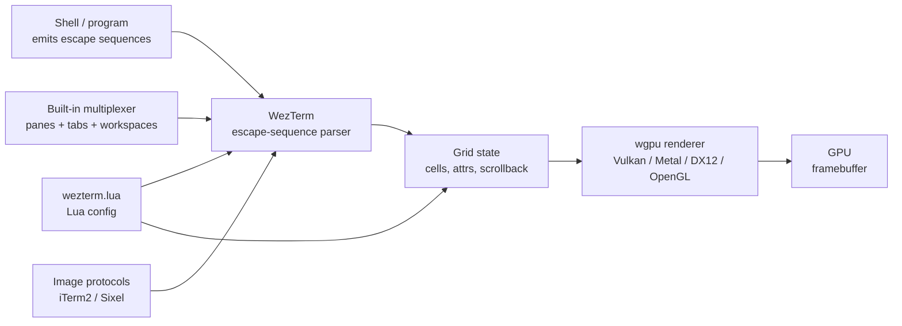

# WezTerm — A GPU Terminal with Built-in Multiplexer and Lua Scripting

**WezTerm** is a GPU-accelerated terminal emulator written in
**Rust**, with a **built-in multiplexer**, **Lua scripting** for
configuration and runtime extensions, and support for the
**iTerm2** and **Sixel** image protocols. Distributed under
**MIT**, WezTerm runs on **Linux, macOS, Windows, and BSD**.

WezTerm's bet: ship the multiplexer + scripting *inside* the
terminal, so users don't need `tmux` or `zellij` for most
workflows. Configuration is a full Lua program — `wezterm.lua` —
which can dynamically change key bindings, define event
handlers, and call the full WezTerm API.

> **TL;DR.** WezTerm is the canonical "multiplexer + scripting
> in one" terminal. Install with `x env use wezterm`, or
> `brew install --cask wezterm`, or `apt install wezterm`. Lua
> config, built-in panes and tabs, iTerm2 / Sixel image
> protocols, all in a single Rust binary.

## Why does WezTerm exist?

Most terminals split responsibilities: the terminal renders
text; `tmux` multiplexes; `.zshrc` configures the shell; a
separate tool handles images. WezTerm consolidates:

1. **Built-in multiplexer.** Panes, tabs, and a workspace
   model — no separate tmux process required.
2. **Lua scripting.** Configuration is a Lua program.
   `wezterm.lua` can define event handlers, watch files,
   call out to the OS, and react to terminal events.
3. **Image protocols.** iTerm2 (full) + Sixel — display
   images and animations inline.
4. **GPU rendering via wgpu.** Cross-platform GPU acceleration
   (Vulkan / Metal / DX12 / OpenGL).

## Architecture



Two Rust crates (split internally):

- `wezterm` — the terminal binary.
- `wezterm-gui` — the GUI / window / event loop.
- `wezterm-mux` — the built-in multiplexer.
- `config` — Lua configuration loader.

## How does it differ from similar tools?

| Tool | Renderer | Multiplexer | Config | Best for |
| --- | --- | --- | --- | --- |
| **WezTerm** | wgpu | Built-in (Lua) | Lua | Multiplexer + scripting in one |
| **[Kitty](https://sw.kovidgoyal.net/kitty/)** | OpenGL 3.3 | Built-in (kitty-session) | Plain text | Image protocols, kittens |
| **[Alacritty](https://alacritty.org/)** | OpenGL ES 2.0 | External (tmux) | TOML | Smallest, fastest |
| **[Ghostty](https://ghostty.org/)** | Metal / OpenGL | External (tmux) | TOML / MoonBit | Native per-platform UI |
| **[Tabby](https://tabby.sh/)** | CPU (Electron) | Built-in | YAML | GUI config, SSH manager |

## When to use vs when NOT

**Use WezTerm when:**

- You want a built-in multiplexer without depending on tmux.
- You want Lua scripting for runtime configuration.
- You want cross-platform consistency (Linux / macOS / Windows
  / BSD in one binary).
- You want iTerm2 / Sixel image protocols.

**Don't use WezTerm when:**

- You want the smallest terminal (use Alacritty).
- You want native macOS UI (use Ghostty for native AppKit).
- You want a kitten-like plugin system (use Kitty).
- You want zero learning curve (use iTerm2 / Windows
  Terminal).

## How to install

**x-cmd (one command):**

```bash
x env use wezterm
```

**Package managers:**

```bash
# macOS (Homebrew)
brew install --cask wezterm

# Arch Linux
sudo pacman -S wezterm

# Debian / Ubuntu
# (snap or .deb from GitHub Releases — see below)
sudo snap install wezterm

# Fedora
sudo dnf install wezterm

# Windows (Scoop)
scoop install wezterm

# Windows (Winget)
winget install wezterm.wezterm
```

**Pre-built binaries:** Download from
[GitHub Releases](https://github.com/wez/wezterm/releases):
Linux (.deb / .AppImage / tarball), macOS (.dmg), Windows
(.exe installer / portable .zip).

**Build from source:** `cargo install wezterm` (requires Rust
toolchain; full build takes time).

## Configuration

WezTerm uses a **Lua** config (`wezterm.lua`). It's a full Lua
program — you can define functions, watch files, and emit
events.

**Config location:**

- Linux: `~/.config/wezterm/wezterm.lua`
- macOS: `~/.config/wezterm/wezterm.lua`
- Windows: `%APPDATA%\wezterm\wezterm.lua`

### Sample `wezterm.lua`

```lua
-- Pull in a few useful WezTerm APIs
local wezterm = require 'wezterm'
local act = wezterm.action

-- Config
return {
  font_size = 11.0,
  font = wezterm.font 'JetBrains Mono',
  color_scheme = 'Catppuccin Mocha',

  -- Window padding
  window_padding = { left = 4, right = 4, top = 4, bottom = 4 },

  -- Background opacity
  window_background_opacity = 0.95,

  -- Key bindings
  keys = {
    { key = 'a', mods = 'CTRL|SHIFT', action = act.SelectText { 'Visual' } },
    { key = 'Enter', mods = 'CTRL|SHIFT', action = act.SpawnCommandInNewWindow {
      args = { 'zsh' },
    } },
  },

  -- Built-in multiplexer
  mux_enable_default_keybindings = true,

  -- Tab bar
  tab_bar_at_bottom = true,

  -- Live config reload (file watcher)
  automatically_reload_config = true,
}
```

### Live config reload

Set `automatically_reload_config = true` (default true) and
WezTerm watches `wezterm.lua`. Edits apply on save without
restart.

## Built-in multiplexer

WezTerm's multiplexer uses the **mux-server** model. Start a
mux server with `wezterm-mux-server`, then connect clients
with `wezterm connect`. Or use the built-in one inside the GUI.

Default keybindings (when `mux_enable_default_keybindings = true`):

| Action | Default binding |
| --- | --- |
| Split horizontally | `Ctrl+Alt+|` |
| Split vertically | `Ctrl+Alt+_` |
| Activate pane (focus) | `Ctrl+Alt+h/j/k/l` |
| New tab | `Ctrl+Alt+t` |
| Close pane | `Ctrl+Alt+w` |
| Detach / reattach | `:mux:detach` / `wezterm connect` |

For heavier multiplexing (cross-machine session persistence),
pair with `tmux` or `zellij`.

## Image protocols

WezTerm ships support for two image protocols:

| Protocol | Status in WezTerm |
| --- | --- |
| **iTerm2** | ✅ Full — including animations |
| **Sixel** | ✅ Stable |
| Kitty graphics | ❌ Not implemented |

Display an image:

```sh
# Display a single image
wezterm imgcat image.png

# Display in TUI (e.g. yazi file manager)
yazi   # supports both iTerm2 and Sixel via wezterm
```

## Lua scripting beyond config

`wezterm.lua` can subscribe to events:

```lua
-- Watch a file and react
wezterm.on('window-focus-changed', function(window, pane)
  if window:get_title() == 'work' then
    window:set_title('work — focused')
  end
end)

-- Override the default URL launcher
wezterm.on('open-uri', function(window, pane, uri)
  -- Custom logic before opening
  wezterm.log_info('opening ' .. uri)
  -- Open with custom command
  wezterm.run_child_process { 'firefox', uri }
end)

-- Define a custom domain
wezterm.on('format-window-title', function(title, pane)
  return pane:get_current_working_dir().file_name .. ' — ' .. title
end)
```

The Lua API surface is documented at
<https://wezfurlong.org/wezterm/config/lua/>

## System requirements

| Requirement | Detail |
| --- | --- |
| **GPU** | Vulkan / Metal / DX12 / OpenGL (via wgpu) |
| **Platforms** | Linux, macOS, Windows, BSD |
| **Build** | Rust toolchain (source build) |
| **Disk** | ~80 MB install (single binary) |

## Key features

| Feature | Description |
| --- | --- |
| **Built-in multiplexer** | Panes, tabs, workspaces via `wezterm-mux-server`. |
| **Lua config + scripting** | Full Lua program; event handlers; runtime API. |
| **iTerm2 / Sixel image protocols** | Display images and animations inline. |
| **GPU rendering** | wgpu-based, cross-platform (Vulkan / Metal / DX12 / OpenGL). |
| **Live config reload** | `wezterm.lua` edits apply on save. |
| **SSH integration** | `wezterm connect ssh://user@host` opens an SSH session through WezTerm. |
| **SSH domain** | Remote sessions through local WezTerm (similar to Kitty's `kitten ssh`). |
| **Custom URL handlers** | Override `open-uri` to control how links are opened. |
| **Font ligatures** | Programmer font ligature support. |
| **Hyperlinks** | OSC 8 hyperlinks with custom URIs. |

## Typical use cases

- **All-in-one workflow** — multiplexer + scripting in one
  binary; no tmux required.
- **Cross-platform consistency** — same `wezterm.lua` on
  Linux, macOS, and Windows.
- **Power users who want programmable config** — Lua is more
  flexible than TOML / plain text / YAML.
- **DevOps / SSH** — `wezterm ssh` for fast SSH sessions;
  `wezterm connect ssh://…` for persistent connections.
- **Image-rich workflows** — `imgcat` for inline images;
  `yazi` for file management with image previews.

## Pro / Con / Verdict

| Dimension | Verdict |
| --- | --- |
| **Pro** | Built-in multiplexer — no tmux required for most workflows |
| **Pro** | Full Lua scripting — runtime event handlers |
| **Pro** | Cross-platform (Linux, macOS, Windows, BSD) in one binary |
| **Pro** | iTerm2 + Sixel image protocols |
| **Pro** | MIT licensed |
| **Con** | Lua config is more to learn than TOML / plain text |
| **Con** | Larger binary than Alacritty / Kitty |
| **Con** | Kitty graphics protocol not supported (only iTerm2 / Sixel) |
| **Verdict** | **Recommended** for users who want multiplexer + scripting in one terminal; **skip** if you want the smallest terminal or TOML config. |

## Things to keep in mind

- **Lua is the only config language.** If you want TOML or
  YAML, use Alacritty or Kitty.
- **Multiplexer is local-only by default.** For cross-machine
  sessions, pair with `tmux` or use `zellij`.
- **SSH domain** — `wezterm connect ssh://user@host` opens
  the SSH session through local WezTerm, with local fonts,
  color schemes, and config. Powerful for dev workflows.
- **wgpu + driver issues.** Some older virtualized GPUs have
  wgpu issues; in those cases, fallback drivers are
  available.
- **MIT licensed.** Permissive — forking and distributing is
  fine; commercial use allowed.

## Timeline

- **2017** — WezTerm created by Wez Furlong.
- **2018-12** — First public release.
- **2020** — Lua configuration lands; event handlers.
- **2021** — Built-in multiplexer via `wezterm-mux-server`.
- **2022** — wgpu renderer replaces the early OpenGL backend.
- **2023** — iTerm2 image protocol support.
- **2024-09** — Sixel support stabilized.
- **2026-06** — current 2026.06.00 — Wayland 1.24 protocol
  support; improved Lua ergonomics.

## Source-code tour

WezTerm lives in
[`wez/wezterm`](https://github.com/wez/wezterm). Major Rust
crates:

- `wezterm` — the main binary entry point.
- `wezterm-gui` — the GUI / window / event loop.
- `wezterm-mux` — the built-in multiplexer.
- `config` — Lua configuration loader.

Build:

```bash
git clone https://github.com/wez/wezterm
cd wezterm
cargo build --release
./target/release/wezterm
```

## What next?

- **Quick start** — `x env use wezterm`, then drop a
  `wezterm.lua` into `~/.config/wezterm/`.
- **Try the multiplexer** — `Ctrl+Alt+|` to split
  horizontally; `Ctrl+Alt+h/j/k/l` to focus panes.
- **Subscribe to an event** — add an `on(...)` handler in
  `wezterm.lua`.
- **SSH domain** — `wezterm connect ssh://user@host`.

## Related Tools

- [Alacritty](https://alacritty.org/) — smallest, fastest GPU
  terminal.
- [Kitty](https://sw.kovidgoyal.net/kitty/) — image protocols +
  kittens.
- [Ghostty](https://ghostty.org/) — native per-platform UI.
- [tmux](https://github.com/tmux/tmux) — heavier / cross-machine
  multiplexer.
- [yazi](https://github.com/sxyazi/yazi) — file manager with
  iTerm2 / Sixel image previews.

## Source & Official Resources

- **Website:** <https://wezfurlong.org/wezterm/>
- **GitHub:** <https://github.com/wez/wezterm>
- **Configuration reference:**
  <https://wezfurlong.org/wezterm/config/>
- **Lua API reference:**
  <https://wezfurlong.org/wezterm/config/lua/>
- **Releases:**
  <https://github.com/wez/wezterm/releases>
- **Roadmap / issues:**
  <https://github.com/wez/wezterm/issues>