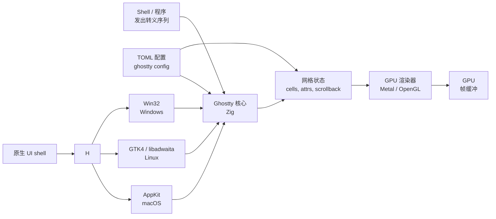

# Ghostty — 每平台原生 UI 的 GPU 加速终端

**Ghostty** 是由 Mitchell Hashimoto（HashiCorp 联合创始人）编写的
GPU 加速终端模拟器，提供**每平台原生 UI**——macOS 用 AppKit、
Linux 用 GTK4 / libadwaita、Windows 用 Win32。用 **Zig**（核心）
加 **Swift** 包装（macOS）实现，MIT 协议。

Ghostty 的赌注：大多数终端用一套跨平台 GUI 工具包（Electron、
Qt、GTK），然后在其上叠加平台特定行为。Ghostty 反过来——**一个
核心，三套原生 UI**——每个平台获得一流集成（菜单栏、快捷键、
vibrancy、任务栏、IME）。

> **TL;DR。** Ghostty 是经典的"每平台原生 UI 终端"。用
> `x env use ghostty` 安装，或 `brew install --cask ghostty`，
> 或从 ghostty.org 下载。原生 AppKit（macOS）、GTK4 /
> libadwaita（Linux）、Win32（Windows）。GPU 加速、启动快。

## Ghostty 为什么存在？

跨平台 GUI 工具包（Electron、Qt、GTK）是务实的捷径。它们让一套
代码库在每个平台上运行——但结果感觉**通用**，不原生：

- 在 macOS 上，菜单栏不用系统菜单。
- 在 Linux 上，标题栏不用窗口管理器的主题。
- 在 Windows 上，任务栏没有跳转列表 / 进度条。

Ghostty 的答案：写三套原生 UI 与一个共享核心。Zig 编译到所有三个
平台；平台特定的 shell（macOS 上的 Swift、Linux 上的 GTK、
Windows 上的 Win32）小巧且不碍事。

## 架构



三个部分：

- **核心**（Zig）—— 终端模拟、转义序列解析、网格状态、GPU 渲染。
  跨平台。
- **原生 UI** —— AppKit / GTK4 / Win32。通过 C ABI 与核心对话。
- **配置**（TOML）—— `ghostty config` 读取与验证。

## 与相似工具的对比

| 工具 | 渲染器 | 原生 UI | 配置 | 最佳场景 |
| --- | --- | --- | --- | --- |
| **Ghostty** | Metal / OpenGL | ✅ 每平台原生 | TOML | 原生 UX、快速启动 |
| **[Alacritty](https://alacritty.org/)** | OpenGL ES 2.0 | ❌ winit（跨平台） | TOML | 最小、最快 |
| **[Kitty](https://sw.kovidgoyal.net/kitty/)** | OpenGL 3.3 | ❌ winit + 自定义 | 纯文本 | 图像协议、kittens |
| **[WezTerm](https://wezfurlong.org/wezterm/)** | wgpu | ❌ wgpu-native | Lua | 多路复用 + 脚本 |
| **[Tabby](https://tabby.sh/)** | CPU（Electron） | ❌ Electron | YAML | GUI 配置、SSH 管理 |

## 何时用 vs 何时不用

**用 Ghostty 的场景：**

- 你想要在平台上感觉**原生**的终端（macOS 菜单栏、Linux
  GTK4 headerbar、Windows 任务栏跳转列表）。
- 你想要快速启动（Zig + 小原生 shell）。
- 你想要 Sixel 图像协议支持（1.0 起）。
- 你想要 GPU 加速而无 Electron。

**不用 Ghostty 的场景：**

- 你想要内置标签（计划 1.2；1.0 没有）。
- 你想要 Lua / Kittens 风格插件系统。
- 你想要最小二进制（Alacritty 更小）。
- 你依赖扩展 / kittens / 可编程配置。

## 如何安装

**x-cmd（一行命令）：**

```bash
x env use ghostty
```

**包管理器：**

```bash
# macOS（Homebrew）
brew install --cask ghostty

# Arch Linux
sudo pacman -S ghostty

# Fedora（Copr）
sudo dnf copr enable -y alternateved/ghostty
sudo dnf install ghostty

# openSUSE
sudo zypper install ghostty
```

**预构建二进制：** 从 <https://ghostty.org/download> 下载。

**从源码构建：** 见 <https://ghostty.org/docs/install/build-from-source>。

## 配置

Ghostty 使用 **TOML** 配置。两种设置方式：

- `~/.config/ghostty/config` —— 标准配置文件。
- `ghostty +show-config > ghostty.conf` —— 生成默认配置，所有选项都注释。

### `~/.config/ghostty/config` 示例

```toml
# 字体
font-family = "JetBrains Mono"
font-size = 12

# 窗口
window-padding-x = 4
window-padding-y = 4
background-opacity = 0.95

# 主题
theme = "Catppuccin Mocha"

# 光标
cursor-style = "bar"
cursor-blink = true

# Scrollback
scrollback-limit = 10000

# 鼠标
mouse-hide-while-typing = true

# 标签栏
gtk-titlebar-hide-on-focus = false

# Sixel
# 图像协议自 1.0 起默认启用
```

### 配置实时重载

Ghostty 保存配置后自动重载。

## 每平台原生 UI 特性

| 平台 | 原生集成 |
| --- | --- |
| **macOS** | AppKit 菜单栏、vibrancy、Quick Look、系统快捷键（Cmd+T、Cmd+W）、Mission Control、IME、macOS 原生窗口控件 |
| **Linux** | GTK4 / libadwaita headerbar、系统主题、Wayland + X11、IME、系统快捷键（Ctrl+Shift+T、Ctrl+Shift+W）、portals（文件选择器、通知） |
| **Windows** | Win32 窗口、任务栏跳转列表、任务栏进度、原生右键菜单、IME、系统快捷键（Ctrl+T、Ctrl+W） |

## 图像协议

Ghostty 自 1.0（2026 年 8 月）起支持 **Sixel**。**iTerm2** 与
**Kitty graphics** 在计划中。

```sh
# 显示单张图像
ghostty +image image.png

# 在 TUI 中显示（例如 yazi）
yazi
```

## 系统要求

| 要求 | 细节 |
| --- | --- |
| **GPU** | Metal（macOS）/ OpenGL（Linux + Windows） |
| **Linux** | 要求 GTK4 / libadwaita；1.0 移除 GTK3 兜底 |
| **macOS** | 11.0（Big Sur）或更新 |
| **Windows** | Windows 10 v1903 或更新 |
| **构建** | Zig 0.13+（源码构建） |

## 关键功能

| 功能 | 描述 |
| --- | --- |
| **每平台原生 UI** | AppKit / GTK4 / Win32——非 Electron、非 Qt。 |
| **GPU 渲染** | macOS 用 Metal，Linux + Windows 用 OpenGL。 |
| **快速启动** | Zig 核心 + 小原生 shell。 |
| **TOML 配置** | 带注释的纯文本。 |
| **配置实时重载** | 编辑 `~/.config/ghostty/config` 保存即生效。 |
| **Sixel 图像协议** | 自 1.0 起。iTerm2 + Kitty graphics 计划中。 |
| **Shell 集成** | 在 scrollback 中标记每个命令的开始 / 结束。 |
| **自动更新** | 内置自动更新机制（macOS 上用 Homebrew，其他地方用系统包）。 |
| **macOS Quick Look** | 在文件路径上按空格预览。 |
| **Linux Wayland + X11** | 都支持；Wayland 在可用时为默认。 |

## 典型场景

- **每平台原生 UX** —— Apple 用户得到 AppKit；Linux 用户得到
  GTK4 / libadwaita；Windows 用户得到 Win32。
- **快速启动** —— `ghostty` 在大多数机器上 < 100 ms 启动。
- **轻量 + 功能丰富** —— 小二进制、无 Electron、但 GPU 加速。
- **跨平台一致** —— 所有三个平台上同一配置格式（TOML）；同一键
  绑定；同一行为。

## 优 / 劣 / 结论

| 维度 | 结论 |
| --- | --- |
| **优** | 每平台原生 UI——处处一流集成 |
| **优** | 快速启动（Zig + 小原生 shell） |
| **优** | 每平台 GPU 渲染 |
| **优** | TOML 配置实时重载 |
| **优** | MIT 协议 |
| **劣** | 1.0 没有内置标签（计划 1.2） |
| **劣** | 没有 Lua / kittens 插件系统 |
| **劣** | 目前仅 Sixel 图像协议（iTerm2 / Kitty graphics 计划中） |
| **劣** | Linux 要求 GTK4 / libadwaita；GTK3 兜底已移除 |
| **结论** | **推荐**给重视原生 UX 与快速启动的用户；**跳过**如果你现在就要内置标签或者插件系统。 |

## 需要记住的事

- **1.0 没有内置标签。** 用 tmux / zellij 做分屏；通过 OS 做多窗口。
  标签目标 1.2。
- **目前仅 Sixel 图像协议。** iTerm2 与 Kitty graphics 计划中。
- **Linux 要求 GTK4 / libadwaita。** 仅 GTK3 的老发行版（Debian 11、
  CentOS 7）无法工作。
- **macOS 11+** 才能用 Metal 渲染器。老 macOS 不支持。
- **自动更新**默认开启；可以在配置里关闭。

## 时间线

- **2022-12** —— Mitchell Hashimoto 宣布 Ghostty。
- **2023-04** —— 首次源码发布（早期开发）。
- **2024-08** —— 首次公开预览版。
- **2025-12** —— RC1 加入 GTK4 / libadwaita 支持。
- **2026-08** —— **Ghostty 1.0**——首个稳定版。每平台原生 UI；Sixel 支持。
- **2026-Q4** —— 1.1 改进多窗口。
- **2027-Q1** —— 1.2 加入内置标签（目标）。

## 源码巡礼

Ghostty 在 [`ghostty-org/ghostty`](https://github.com/ghostty-org/ghostty)。
主要部分：

- `src/` —— Zig 核心（终端模拟、GPU 渲染）。
- `os/` —— 平台特定 UI：
  - `os/macos/` —— Swift + AppKit。
  - `os/linux/` —— GTK4 / libadwaita（Zig 绑定）。
  - `os/windows/` —— Win32（Zig 绑定）。
- `website/` —— 文档站点。

构建：

```bash
git clone https://github.com/ghostty-org/ghostty
cd ghostty
zig build
./zig-out/bin/ghostty
```

## 下一步？

- **快速开始** —— `x env use ghostty`，然后把 `config` 文件放进
  `~/.config/ghostty/`。
- **试试原生快捷键** —— `Cmd+T` / `Cmd+W`（macOS），
  `Ctrl+Shift+T` / `Ctrl+Shift+W`（Linux / Windows）。
- **Sixel 图像** —— `ghostty +image image.png` 或在 TUI（如 `yazi`）里。
- **搭配 tmux** —— 在 Ghostty 1.2 之前用 tmux 做分屏与会话。

## 相关工具

- [Alacritty](https://alacritty.org/) —— 最小、最快的 GPU 终端。
- [Kitty](https://sw.kovidgoyal.net/kitty/) —— 图像协议 + kittens。
- [WezTerm](https://wezfurlong.org/wezterm/) —— 多路复用 + 脚本。
- [tmux](https://github.com/tmux/tmux) —— Ghostty 1.2 之前的分屏。
- [yazi](https://github.com/sxyazi/yazi) —— 带图像预览的文件管理器。

## 源码与官方资源

- **官网：** <https://ghostty.org/>
- **GitHub：** <https://github.com/ghostty-org/ghostty>
- **配置参考：** <https://ghostty.org/docs/config>
- **发布：** <https://github.com/ghostty-org/ghostty/releases>
- **路线图 / issue：** <https://github.com/ghostty-org/ghostty/issues>