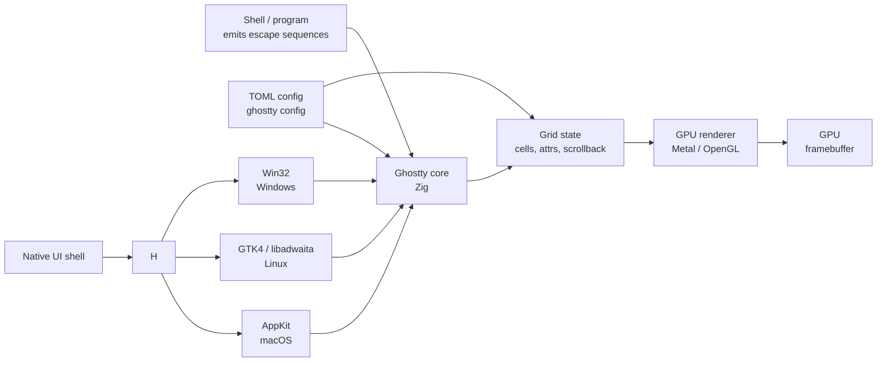

# Ghostty — Native per-Platform UI with GPU Acceleration

**Ghostty** is a GPU-accelerated terminal emulator written by
Mitchell Hashimoto (HashiCorp co-founder), shipping **native
UI per platform** — AppKit on macOS, GTK4 / libadwaita on
Linux, Win32 on Windows. Implemented in **Zig** (core) with a
**Swift** wrapper for macOS, distributed under **MIT**.

Ghostty's bet: most terminals render with one cross-platform
GUI toolkit (Electron, Qt, GTK), then layer platform-specific
behavior on top. Ghostty takes the opposite approach — **one
core, three native UIs** — so each platform gets first-class
integration (menu bar, shortcuts, vibrancy, taskbar, IME).

> **TL;DR.** Ghostty is the canonical "native per-platform UI
> terminal". Install with `x env use ghostty`, or
> `brew install --cask ghostty`, or download from
> ghostty.org. Ships native AppKit on macOS, GTK4 / libadwaita
> on Linux, Win32 on Windows. GPU-accelerated, fast startup.

## Why does Ghostty exist?

Cross-platform GUI toolkits (Electron, Qt, GTK) are a
pragmatic shortcut. They let one codebase run on every
platform — but the result feels **generic**, not native:

- On macOS, the menu bar doesn't use the system menu.
- On Linux, the title bar doesn't use the window manager's
  theme.
- On Windows, the taskbar doesn't get jump lists / progress
  bars.

Ghostty's answer: write three native UIs and one shared core.
Zig compiles to all three platforms; the platform-specific
shell (Swift on macOS, GTK on Linux, Win32 on Windows) is
small and stays out of the way.

## Architecture



Three pieces:

- **Core** (Zig) — terminal emulation, escape-sequence parser,
  grid state, GPU rendering. Cross-platform.
- **Native UI** — AppKit / GTK4 / Win32. Talks to the core via
  a C ABI.
- **Config** (TOML) — `ghostty config` reads and validates.

## How does it differ from similar tools?

| Tool | Renderer | Native UI | Config | Best for |
| --- | --- | --- | --- | --- |
| **Ghostty** | Metal / OpenGL | ✅ Native per platform | TOML | Native UX, fast startup |
| **[Alacritty](https://alacritty.org/)** | OpenGL ES 2.0 | ❌ winit (cross-platform) | TOML | Smallest, fastest |
| **[Kitty](https://sw.kovidgoyal.net/kitty/)** | OpenGL 3.3 | ❌ winit + custom | Plain text | Image protocols, kittens |
| **[WezTerm](https://wezfurlong.org/wezterm/)** | wgpu | ❌ wgpu-native | Lua | Multiplexer + scripting |
| **[Tabby](https://tabby.sh/)** | CPU (Electron) | ❌ Electron | YAML | GUI config, SSH manager |

## When to use vs when NOT

**Use Ghostty when:**

- You want a terminal that **feels native** on your platform
  (menu bar on macOS, GTK4 headerbar on Linux, taskbar jump
  list on Windows).
- You want fast startup (Zig + small native shell).
- You want Sixel image protocol support (since 1.0).
- You want GPU acceleration without Electron.

**Don't use Ghostty when:**

- You want built-in tabs (planned for 1.2; not in 1.0).
- You want a Lua / Kittens-style plugin system.
- You want the smallest binary (Alacritty is smaller).
- You depend on extensions / kittens / programmable config.

## How to install

**x-cmd (one command):**

```bash
x env use ghostty
```

**Package managers:**

```bash
# macOS (Homebrew)
brew install --cask ghostty

# Arch Linux
sudo pacman -S ghostty

# Fedora (Copr)
sudo dnf copr enable -y alternateved/ghostty
sudo dnf install ghostty

# openSUSE
sudo zypper install ghostty
```

**Pre-built binaries:** Download from
<https://ghostty.org/download>.

**Build from source:** See
<https://ghostty.org/docs/install/build-from-source>.

## Configuration

Ghostty uses a **TOML** config. Two ways to set it:

- `~/.config/ghostty/config` — the canonical config file.
- `ghostty +show-config > ghostty.conf` — generate a default
  with all options commented out.

### Sample `~/.config/ghostty/config`

```toml
# Font
font-family = "JetBrains Mono"
font-size = 12

# Window
window-padding-x = 4
window-padding-y = 4
background-opacity = 0.95

# Theme
theme = "Catppuccin Mocha"

# Cursor
cursor-style = "bar"
cursor-blink = true

# Scrollback
scrollback-limit = 10000

# Mouse
mouse-hide-while-typing = true

# Tab bar
gtk-titlebar-hide-on-focus = false

# Sixel
# Image protocol is enabled by default since 1.0
```

### Live config reload

Ghostty reloads its config automatically on save.

## Native UI features per platform

| Platform | Native integration |
| --- | --- |
| **macOS** | AppKit menu bar, vibrancy, Quick Look, system shortcuts (Cmd+T, Cmd+W), Mission Control, IME, macOS-native window controls |
| **Linux** | GTK4 / libadwaita headerbar, system theme, Wayland + X11, IME, system shortcuts (Ctrl+Shift+T, Ctrl+Shift+W), portals (file picker, notifications) |
| **Windows** | Win32 window, taskbar jump list, taskbar progress, native context menus, IME, system shortcuts (Ctrl+T, Ctrl+W) |

## Image protocols

Ghostty ships with **Sixel** support since 1.0 (Aug 2026).
**iTerm2** and **Kitty graphics** are planned.

```sh
# Display a single image
ghostty +image image.png

# Inside a TUI (e.g. yazi)
yazi
```

## System requirements

| Requirement | Detail |
| --- | --- |
| **GPU** | Metal (macOS) / OpenGL (Linux + Windows) |
| **Linux** | GTK4 / libadwaita required; GTK3 fallback removed in 1.0 |
| **macOS** | 11.0 (Big Sur) or later |
| **Windows** | Windows 10 v1903 or later |
| **Build** | Zig 0.13+ (source build) |

## Key features

| Feature | Description |
| --- | --- |
| **Native UI per platform** | AppKit / GTK4 / Win32 — not Electron, not Qt. |
| **GPU rendering** | Metal on macOS, OpenGL on Linux + Windows. |
| **Fast startup** | Zig core + small native shell. |
| **TOML config** | Plain text with comments. |
| **Live config reload** | Edits to `~/.config/ghostty/config` apply on save. |
| **Sixel image protocol** | Since 1.0. iTerm2 + Kitty graphics planned. |
| **Shell integration** | Marks each command's start / end in scrollback. |
| **Auto-update** | Built-in auto-update mechanism (Homebrew on macOS, system packages elsewhere). |
| **Quick Look on macOS** | Press space over a file path to preview. |
| **Wayland + X11 on Linux** | Both supported; Wayland is default when available. |

## Typical use cases

- **Native UX on each platform** — Apple users get AppKit;
  Linux users get GTK4 / libadwaita; Windows users get Win32.
- **Fast startup** — `ghostty` opens in < 100 ms on most
  machines.
- **Lightweight + feature-rich** — small binary, no
  Electron, but GPU-accelerated.
- **Cross-platform consistency** — same config format (TOML)
  on all three platforms; same key bindings; same behavior.

## Pro / Con / Verdict

| Dimension | Verdict |
| --- | --- |
| **Pro** | Native UI per platform — first-class integration everywhere |
| **Pro** | Fast startup (Zig + small native shell) |
| **Pro** | GPU rendering on every platform |
| **Pro** | TOML config with live reload |
| **Pro** | MIT licensed |
| **Con** | No built-in tabs in 1.0 (planned for 1.2) |
| **Con** | No Lua / kittens plugin system |
| **Con** | Sixel-only image protocol today (iTerm2 / Kitty graphics planned) |
| **Con** | Linux requires GTK4 / libadwaita; GTK3 fallback gone |
| **Verdict** | **Recommended** for users who value native UX and fast startup; **skip** if you want built-in tabs now or a plugin system. |

## Things to keep in mind

- **No built-in tabs in 1.0.** Use tmux / zellij for splits;
  multi-window via OS. Tabs target 1.2.
- **Sixel only for image protocols today.** iTerm2 and Kitty
  graphics are planned.
- **GTK4 / libadwaita required on Linux.** Older GTK3-only
  distros (Debian 11, CentOS 7) won't work.
- **macOS 11+** for Metal renderer. Older macOS not supported.
- **Auto-update** is on by default; you can disable it in the
  config.

## Timeline

- **2022-12** — Mitchell Hashimoto announces Ghostty.
- **2023-04** — First source release (early development).
- **2024-08** — First public preview release.
- **2025-12** — RC1 with GTK4 / libadwaita support.
- **2026-08** — **Ghostty 1.0** — first stable release. Native
  UI per platform; Sixel support.
- **2026-Q4** — 1.1 with multi-window improvements.
- **2027-Q1** — 1.2 with built-in tabs (target).

## Source-code tour

Ghostty lives in [`ghostty-org/ghostty`](https://github.com/ghostty-org/ghostty).
Major pieces:

- `src/` — Zig core (terminal emulation, GPU rendering).
- `os/` — Platform-specific UI:
  - `os/macos/` — Swift + AppKit.
  - `os/linux/` — GTK4 / libadwaita (Zig bindings).
  - `os/windows/` — Win32 (Zig bindings).
- `website/` — the documentation site.

Build:

```bash
git clone https://github.com/ghostty-org/ghostty
cd ghostty
zig build
./zig-out/bin/ghostty
```

## What next?

- **Quick start** — `x env use ghostty`, then drop a
  `config` file into `~/.config/ghostty/`.
- **Try native shortcuts** — `Cmd+T` / `Cmd+W` (macOS),
  `Ctrl+Shift+T` / `Ctrl+Shift+W` (Linux / Windows).
- **Sixel image** — `ghostty +image image.png` or in a TUI
  like `yazi`.
- **Pair with tmux** — for splits and sessions until 1.2.

## Related Tools

- [Alacritty](https://alacritty.org/) — smallest, fastest GPU
  terminal.
- [Kitty](https://sw.kovidgoyal.net/kitty/) — image protocols
  + kittens.
- [WezTerm](https://wezfurlong.org/wezterm/) — multiplexer +
  scripting.
- [tmux](https://github.com/tmux/tmux) — for splits until
  Ghostty 1.2.
- [yazi](https://github.com/sxyazi/yazi) — file manager with
  image previews.

## Source & Official Resources

- **Website:** <https://ghostty.org/>
- **GitHub:** <https://github.com/ghostty-org/ghostty>
- **Configuration reference:**
  <https://ghostty.org/docs/config>
- **Releases:**
  <https://github.com/ghostty-org/ghostty/releases>
- **Roadmap / issues:**
  <https://github.com/ghostty-org/ghostty/issues>